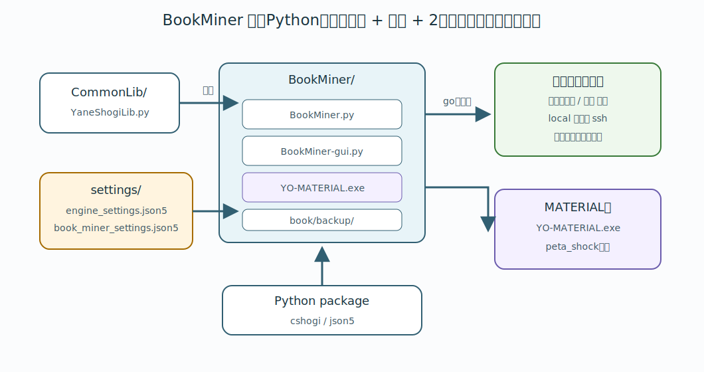

# 2. セットアップ

この章では、BookMiner を起動するまでに必要な準備を説明します。用語は [1. 用語説明](01-terms.md) で説明しています。

## 必要なもの

- Python 3
- `cshogi`
- `json5`
- 探索用エンジン
- `BookMiner.py` と同じフォルダに置いた `YO-MATERIAL.exe`

## フォルダ構成

BookMiner は次の場所で実行する想定です。

```text
YaneuraOu-ScriptCollection/
  CommonLib/
  BookMiner/
    BookMiner.py
    YO-MATERIAL.exe
    README.md
    docs/
    settings/
      engine_settings-sample.json5
      book_miner_settings-sample.json5
      engine_settings.json5
      book_miner_settings.json5
```

BookMiner は `../CommonLib/YaneShogiLib.py` を使います。`BookMiner/` だけを別フォルダに移動すると動きません。

`engine_settings.json5` と `book_miner_settings.json5` は、ユーザーごとの実設定ファイルです。
GitHub で配布されるのは `*-sample.json5` です。
初回セットアップ時に sample をコピーして、実設定ファイルを作ってから編集してください。
実設定ファイルは `.gitignore` に入っているので、ユーザーごとの設定が `git pull` で衝突しにくくなっています。



## Python のインストール

Windows では python.org から Python 3 をインストールし、`py` コマンドが使える状態にしてください。

インストール後、次のように確認します。

```powershell
py --version
```

Linux/macOS では、環境に合わせて Python 3 を用意してください。

```bash
python3 --version
```

## cshogi と json5 のインストール

BookMiner は `cshogi` と `json5` を使います。
`json5` は、設定ファイルにコメントを書けるようにするために使います。

Windows:

```powershell
py -m pip install cshogi json5
```

Linux/macOS:

```bash
python3 -m pip install cshogi json5
```

## 設定ファイルを作成する

BookMiner は次の2つの実設定ファイルを読みます。

```text
settings/engine_settings.json5
settings/book_miner_settings.json5
```

ただし、この2つはユーザーの環境ごとに内容が変わるため、配布物としては `*-sample.json5` だけを置いています。
初回セットアップ時に、sample をコピーして実設定ファイルを作ってください。

Windows:

```powershell
Copy-Item .\settings\engine_settings-sample.json5 .\settings\engine_settings.json5
Copy-Item .\settings\book_miner_settings-sample.json5 .\settings\book_miner_settings.json5
```

Linux/macOS:

```bash
cp settings/engine_settings-sample.json5 settings/engine_settings.json5
cp settings/book_miner_settings-sample.json5 settings/book_miner_settings.json5
```

以後、編集するのは `*-sample.json5` ではなく、コピーして作った `engine_settings.json5` と `book_miner_settings.json5` です。

## settings/engine_settings.json5 の書き方

`settings/engine_settings.json5` には、BookMiner が局面を思考させる探索用エンジンを書きます。
このファイルは `settings/engine_settings-sample.json5` をコピーして作ります。

場所は次の通りです。

```text
settings/engine_settings.json5
```

例:

```json5
[
    {
        // USIエンジンの実行ファイル、または "ssh ..." で始まる起動コマンド。
        path: "engines/suisho11/YaneuraOuV940AVX2.exe",

        // ログ表示用の名前。
        name: "suisho11",

        // 1局面あたりの探索ノード数。
        nodes: 1000000,

        // 同じ設定のエンジンを何プロセス起動するか。
        multi: 1,
    },
]
```

各項目の意味は次の通りです。

- `path` : USI エンジンの実行ファイル、または `ssh ...` で始まる起動コマンド。
- `name` : ログ表示用の名前。
- `nodes` : 1 局面あたりの探索ノード数。
- `multi` : 同じ設定のエンジンを何プロセス起動するか。

最初は `multi` を `1` にして、エンジンが `readyok` を返すことを確認してください。

`multi` を増やすと、同じ設定の探索用エンジンを複数プロセス起動します。
PCのCPUスレッド数、メモリ、エンジン側の `Threads` や `USI_Hash` との合計を見て調整してください。

複数エンジンを使う場合は、配列に複数の設定を書きます。

```json5
[
    {
        path: "engines/local/YaneuraOuV940AVX2.exe",
        name: "local",
        nodes: 1000000,
        multi: 2,
    },
    {
        path: "engines/local2/YaneuraOuV940AVX2.exe",
        name: "local2",
        nodes: 1000000,
        multi: 2,
    },
]
```

## settings/book_miner_settings.json5 の書き方

`settings/book_miner_settings.json5` には、BookMiner 本体の動作設定を書きます。
このファイルは `settings/book_miner_settings-sample.json5` をコピーして作ります。

場所は次の通りです。

```text
settings/book_miner_settings.json5
```

例:

```json5
{
    // 定期自動バックアップの間隔。単位は秒。
    // 10800 = 3時間。
    auto_save_interval_seconds: 10800,

    // この手数に到達したら、それ以上局面を掘らない。
    max_book_ply: 200,

    // peta_nextの開始局面集合ファイル。
    // このファイルはnコマンドの開始局面を絞るために使う。
    peta_next_start_sfens_path: "book/peta_start_sfens.txt",
}
```

各項目の意味は次の通りです。

- `auto_save_interval_seconds` : 定期自動バックアップの間隔です。単位は秒です。
- `max_book_ply` : この手数に到達したら、それ以上局面を掘りません。
- `peta_next_start_sfens_path` : `n` コマンドの `peta_next` で使う開始局面集合ファイルです。

`auto_save_interval_seconds` の `10800` は 3 時間です。

`max_book_ply` が `200` の場合、ply が 200 に到達した局面では思考せず、`n` コマンドでも ply 200 以降の局面を次の掘削対象として書き出しません。
GUI の `game ply limit` 欄、または CLI の `l` コマンドで実行中に一時的に変更できます。恒久的なデフォルト値は `settings/book_miner_settings.json5` で指定します。

`peta_next_start_sfens_path` は、通常は `book/peta_start_sfens.txt` のままでかまいません。
このファイルが存在する場合、`n` コマンドはそこに書かれた局面集合から定跡ツリーを辿ります。
ファイルが存在しない場合は、平手の初期局面 `startpos` から辿ります。

## SSH 経由で複数 PC を使う方法

`path` が `ssh` で始まる場合、BookMiner はその文字列を SSH コマンドとして起動します。

Windows環境なら、例えば以下のようになります。

```json5
[
    {
        path: "ssh -o ServerAliveInterval=15 worker_pc1 suisho11plus.bat",
        name: "suisho11plus",
        nodes: 50000000,
        multi: 32,
    },
]
```

💡 `-o ServerAliveInterval=15`は、15秒に1回、keep aliveを送って切断されなくするオプションです。sshの設定ファイルのほうで同様の設定をしても構いません。(詳しくはググってください)

`suisho11plus.bat`というバッチファイルを起動するようにしてあり、そのバッチファイルのなかで やねうら王の実行ファイルを起動しています。例えば、以下のように フォルダを移動して、実行するバッチファイルとなっています。

```bat
cd C:\Users\yaneen\Desktop\suisho11plus-spsa
suisho11plus-spsa.exe
```

Linux環境なら、次のようになります。

```json5
[
    {
        path: "ssh worker_pc2 /home/user/engines/suisho11/run-suisho-engine.sh",
        name: "suisho11",
        nodes: 1000000,
        multi: 4,
    },
]
```

リモート側では、シェルスクリプトでエンジンのあるフォルダへ移動してから実行するのが安全です。

```sh
#!/bin/sh
cd /home/user/engines/suisho11 || exit 1
exec ./YaneuraOuV940AVX2
```

BookMiner は SSH のパスワード入力を処理しません。事前に公開鍵認証でログインできるようにしてください。

また、SSH 経由の `path` は内部で空白区切りに分割されます。パスに空白を含めない構成にしてください。

## YO-MATERIAL.exe の配置

`YO-MATERIAL.exe` は `BookMiner.py` と同じフォルダに置きます。

```text
BookMiner/
  BookMiner.py
  YO-MATERIAL.exe
```

`YO-MATERIAL.exe` は同梱していません。自分で MATERIAL 版のやねうら王をビルドするか、やねうら王News Letterで頒布されている最新の MATERIAL 版を入手してください。
入手した実行ファイルは `YO-MATERIAL.exe` という名前に変更して、上記の場所に配置します。

ビルド用の make コマンドは、例えば次のように書きます。`TARGET_CPU` は使う PC の CPU に合わせて変更してください。

```bash
make clean YANEURAOU_EDITION=YANEURAOU_ENGINE_MATERIAL
make -j8 tournament COMPILER=clang++ YANEURAOU_EDITION=YANEURAOU_ENGINE_MATERIAL ENGINE_NAME="YO-MATERIAL" TARGET_CPU=AVX2 EXTRA_CPPFLAGS="-DHASH_KEY_BITS=128 -DENGINE_VERSION=\\\"V9.40YANE\\\""
cp YaneuraOu-by-gcc "../bin/YO-MATERIAL.exe"
```

BookMiner が使う `YO-MATERIAL.exe` は、`makebook peta_shock` コマンドを実行できる必要があります。
自分でビルドしたものを使う場合は、起動して `makebook peta_shock` が使えるビルドになっていることを確認してください。
やねうら王側では、定跡生成系の `makebook` コマンドは、対応するビルド設定が有効なときだけ使えます。

`YO-MATERIAL.exe` を使う理由と peta shock 化の詳細は [10. peta shock 化](10-peta-shock.md) を参照してください。

## やねうら王エンジンの設定方法

やねうら王系エンジンでは、エンジン実行ファイルと同じフォルダに `engine_options.txt` を置くと、`isready` 時に読み込まれます。

BookMiner から起動する探索用エンジンでは、例えば次のようにします。

```text
Threads 1
USI_Hash 1024
BookFile no_book
PvInterval 10000000
NetworkDelay 0
NetworkDelay2 0
MinimumThinkingTime 1000
```

やねうら王のエンジン設定については、以下のページを参考にしてください。

- [思考エンジンオプション - やねうら王Wiki](https://github.com/yaneurao/YaneuraOu/wiki/%E6%80%9D%E8%80%83%E3%82%A8%E3%83%B3%E3%82%B8%E3%83%B3%E3%82%AA%E3%83%97%E3%82%B7%E3%83%A7%E3%83%B3)

NNUE 系エンジンを使う場合は、評価関数に合わせて `EvalDir` や `FV_SCALE` も設定してください。

```text
EvalDir eval
FV_SCALE 40
```

注意点:

- `BookFile` は `no_book` にします。BookMiner が局面を思考させるとき、エンジン自身の定跡は使いません。
- `Threads` は基本的に `1` にし、並列化は `engine_settings.json5` の `multi` で行います。(multi として 論理コアの数 か、論理コアの数 - 2 ぐらいを指定するのが良いと思います。)
- `USI_Hash` は PC のメモリに合わせて調整します。
- `MultiPV` は BookMiner 側が探索中に指定するため、`engine_options.txt` で固定しないでください。

## 起動

`YaneuraOu-ScriptCollection/BookMiner/` をカレントフォルダにして起動します。

Windows:

```powershell
cd YaneuraOu-ScriptCollection\BookMiner
py BookMiner.py
```

Linux/macOS:

```bash
cd YaneuraOu-ScriptCollection/BookMiner
python3 BookMiner.py
```

起動すると、エンジン設定を読み込み、ログファイルが `log/` に作られます。

## 主な入出力

- `book/think_sfens.txt` : 掘る棋譜。1 行が 1 対局です。
- `book/backup/` : BookMiner の通常定跡 DB。`q`、`w`、自動バックアップで `book_miner-タイムスタンプ_局面数.db` が作られます。
- `book/backup/peta_book-....db` : peta shock 化された定跡 DB。詳しくは [10. peta shock 化](10-peta-shock.md) を参照してください。
- `log/` : 実行ログ。
