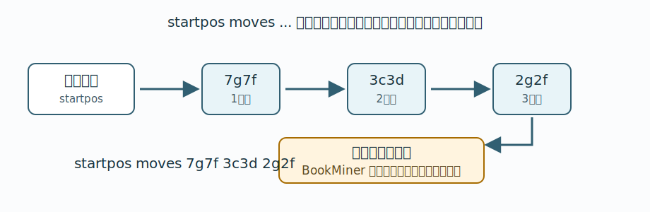

# 3. USI と position コマンド

この章では、BookMiner に渡す局面文字列の基礎を説明します。
BookMiner を使うだけなら USI プロトコル全体を覚える必要はありませんが、`position` コマンドと `startpos moves ...` は理解しておく必要があります。

## USIプロトコルとは

USI は、将棋AIエンジンと将棋GUIがやりとりするためのプロトコルです。
将棋GUIは、局面を設定したり、思考を開始させたりする命令を、テキストのコマンドとしてエンジンへ送ります。

例えば、ある局面をエンジンへ渡すときは `position` コマンドを使います。
そのあと `go` コマンドを送ると、エンジンはその局面について思考します。

BookMiner では、この `position` コマンドで使われる局面表現を入力として使います。

## position コマンド

`position` コマンドは、エンジンが内部に持っている現在局面を指定するための USI コマンドです。

平手の初期局面を指定する場合は、次のように書きます。

```text
position startpos
```

初期局面から指し手を進めた局面を指定する場合は、`moves` のあとに USI形式の指し手を並べます。

```text
position startpos moves 7g7f 3c3d 2g2f
```

これは、平手初期局面から `7g7f`、`3c3d`、`2g2f` と指した局面を表します。



## startpos moves ...

BookMiner の入力ファイルでは、`position` コマンドそのものではなく、先頭の `position ` を取り除いた形を使います。

```text
startpos moves 7g7f 3c3d 2g2f
```

1 行が 1 つの対局、または 1 つの開始局面です。

```text
startpos moves 7g7f 3c3d 2g2f 8c8d
startpos moves 2g2f 8c8d 2f2e 8d8e
```

この形式は、平手初期局面から指し手を順に進めた局面列を表します。
BookMiner はこの行を読み、指し手を先頭から順に辿って、まだ掘っていない局面を探索キューへ積みます。

## sfen ... moves ...

USI の `position` コマンドでは、`startpos` の代わりに `sfen ...` で任意の盤面を直接指定することもできます。

```text
position sfen lnsgkgsnl/1r5b1/ppppppppp/9/9/9/PPPPPPPPP/1B5R1/LNSGKGSNL b - 1
```

そこから指し手を進める場合は、同じように `moves` を続けます。

```text
position sfen lnsgkgsnl/1r5b1/ppppppppp/9/9/9/PPPPPPPPP/1B5R1/LNSGKGSNL b - 1 moves 7g7f
```

BookMiner でも、先頭の `position ` を取り除いた `sfen ... moves ...` 形式を扱えます。
ただし、通常の運用では KifManager が出力する `startpos moves ...` を使えば十分です。

## 将棋所から局面文字列を得る

任意の局面の `startpos moves ...` 文字列を得るには、将棋AI用GUIの `将棋所` を使うと簡単です。

将棋所を起動し、デバッグウィンドウを開いておきます。
その状態で、ある局面についてエンジンに思考させると、GUI からエンジンへ次のような USI コマンドが送られます。

```text
position startpos moves 7g7f 3c3d 2g2f
```

BookMiner の入力ファイルや `book/peta_start_sfens.txt` に書くときは、先頭の `position ` を取り除きます。

```text
startpos moves 7g7f 3c3d 2g2f
```

これで、将棋所上で表示している任意の局面を BookMiner に渡せます。

参考:

- [連載やねうら王miniで遊ぼう！2日目](https://yaneuraou.yaneu.com/2015/12/08/%E9%80%A3%E8%BC%89%E3%82%84%E3%81%AD%E3%81%86%E3%82%89%E7%8E%8Bmini%E3%81%A7%E9%81%8A%E3%81%BC%E3%81%86%EF%BC%812%E6%97%A5%E7%9B%AE/)
