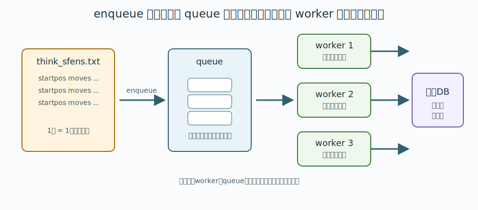
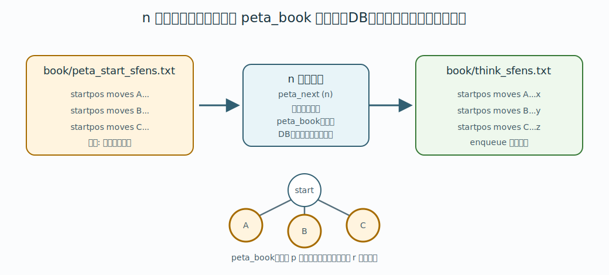
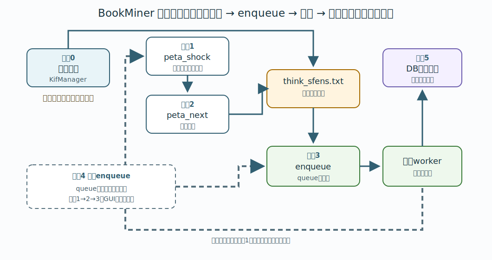

# 4. 定跡を掘るための基礎

この章では、BookMiner に局面を渡して掘る流れ、次に掘る局面の作り方を説明します。
用語は [1. 用語説明](01-terms.md)、`startpos moves ...` 形式は [3. USI と position コマンド](03-usi.md) で説明しています。

## 探索キューと enqueue

BookMiner は、入力ファイルに書かれている局面を読んだ瞬間に、すべてをその場で最後まで探索するわけではありません。

BookMiner の内部には「これから探索する局面」を積んでおく場所があります。この場所を queue と呼びます。queue は待ち行列という意味で、先に積まれたタスクから順に、探索用エンジンへ渡されて処理されます。

`enqueue` は、その queue にタスクを追加する操作です。



BookMiner のコマンドラインでは `t` コマンドが enqueue に相当します。GUI では `enqueue` ボタンを押すと、内部的には `t` コマンドが送られます。

つまり、GUI の `enqueue` は「いますぐ全局面を同期的に掘り終える」ボタンではなく、次のファイルに書かれている局面を読み、まだ掘っていない局面を探索キューへ積むボタンです。

```text
book/think_sfens.txt
```

queue に積まれた局面は、BookMiner が起動している探索スレッドによって順に処理されます。処理の進捗は画面と `log/` のログに出力されます。

GUI の `enqueue進捗` は、BookMiner を起動してから enqueue した累計タスク数に対して、worker が受け取ったタスク数を表示します。

```text
enqueue進捗 30000/50000
```

これは「これまで enqueue した 50000 タスクのうち 30000 タスクが worker に渡った」という意味です。最後に渡った数件はまだ探索中かもしれませんが、残りタスク量を把握する目的では十分です。

もう一度 enqueue すると、分母は追加分だけ増えます。例えば 50000 タスク中 30000 タスクが worker に渡った状態で 72462 行を追加 enqueue した場合、進捗は `30000/122462` のようになります。

## 掘りたい局面を渡す

通常は KifManager で棋譜を抽出し、BookMiner の入力ファイルを作ります。

出力先は次の場所にします。

```text
BookMiner/book/think_sfens.txt
```

BookMiner 側では、起動後に `t` と入力すると、このファイルを読み込みます。

```text
t
```

この `t` コマンドは、GUI では `enqueue` ボタンに対応します。

別のファイルを読む場合は、path を指定します。

```text
t book/my_positions.txt
```

`t` コマンドは各行の指し手を順に辿り、まだ掘っていない局面があれば探索キューへ積みます。積まれたタスクは、探索用エンジンで順に思考されます。

棋譜で指定された途中局面であっても、そこが定跡木の内部ノードなら eval limit では止まりません。
BookMiner は指し手を順に再生して通過します。

ただし、次の指し手が定跡木の外へ出る枝で、その指し手の評価値が eval limit を超えている場合、その指し手の先へは進みません。
つまり、入力棋譜の末尾まで必ず辿るわけではありません。

また、`max_book_ply` に到達した場合も、その対局の処理はそこで止まります。GUIでは `game ply limit` 欄で変更できます。

棋譜の末端まで到達できた場合は、そこからエンジンの best line を `THINK_COMMAND_PLY` 手分だけ延長して掘ります。この延長中も、評価値の絶対値が eval limit を超えたら停止します。

## 探索ログの末尾に出る 1.0 と 0.7

BookMiner が実際にエンジンへ探索させる局面は、探索ログに次のような形で出ます。

```text
[3] sfen ... 42 , 1.0
[3] sfen ... 43 , 0.7
```

行末の `1.0` や `0.7` は MultiPV の数ではなく、その局面で使う探索ノード数の倍率です。

`settings/engine_settings.json5` の `nodes` が `1000000` の場合、`1.0` なら 1000000 nodes、`0.7` なら 700000 nodes で探索します。

BookMiner は、ある局面を探索したあと、その best line に沿って1手進めて次の局面を探索することがあります。
この場合、1手前の探索結果を利用できるので、次の局面は `0.7` 倍のノード数で探索します。
`0.7` 倍でも、1手前の探索結果が無い局面を `1.0` 倍で探索したときと同じ程度の強さの指し手になることが分かっているためです。

途中で別の枝に合流した場合など、1手前の探索結果を利用できない局面では `1.0` 倍で探索します。

## 通常定跡 DB を書き出して peta shock 化する

局面を掘ったら、通常は `p` コマンドを使います。

```text
p
```

`p` は、現在の定跡 DB を通常のやねうら王定跡形式として `book/backup/` に書き出し、その書き出したファイルを peta shock 化して読み込みます。

バックアップの出力先は `book/backup/` です。

```text
book/backup/book_miner-20260607071000_12345.db
```

peta shock 化後のファイルも `book/backup/` に保存されます。通常定跡 DB と同じ timestamp と局面数を使います。

```text
book/backup/peta_book-20260607071000_12345.db
```

`w` コマンドで書き出しだけを行うこともできます。別マシンで peta shock 化する場合は、`w` で作った通常定跡 DB をその別環境へ持っていき、変換後の `peta_book-....db` を `book/backup/` に戻してから `r` で読み込みます。

BookMiner が書き出す `book_miner-....db` は、やねうら王標準定跡フォーマットのテキストファイルです。
書き出し時には `sfen` 文字列で sort し、先頭に `#YANEURAOU-DB2016 1.00` と `# NOE:<局面数>` を付けます。
`makebook peta_shock` は sort 済みの定跡 DB を前提にするので、BookMiner が書き出したファイルをそのまま使うのが安全です。

## peta shock 化の詳細

`p`、`r`、`n` の関係、`makebook peta_shock` の意味、`peta_book` が必要な理由、`value` / `depth` の扱いは [10. peta shock 化](10-peta-shock.md) にまとめています。

ここでは周回作業では次の流れになる、と覚えておけば十分です。

```text
p で peta_book を作って読む
n で次に掘る局面を book/think_sfens.txt に書き出す
t で book/think_sfens.txt を探索 queue に積む
```

反駁された depth 0 best を重点的に延長したい場合は、`n` の代わりに `f` を使います。

```text
p で peta_book を作って読む
f 100 400 で反駁候補を book/think_sfens.txt に書き出す
t で book/think_sfens.txt を探索 queue に積む
```

## 次に掘る局面を求める

peta shock 化した定跡から、leaf の先へ定跡ツリーを伸ばすための局面を求めるには `n` コマンドを使います。

```text
n 30
```

`30` は、root の best move の評価値からどの程度評価値が離れた枝まで辿るかを表す値です。

詳しいアルゴリズムについては、以下のページをご覧ください。

- [10. peta shock 化](10-peta-shock.md)
- [YaneuraOu-ScriptCollection/PetaNext](../../PetaNext/README.md)


```text
n 100 10
```

のように指定すると、rootの best moveの評価値から100離れた枝を、rootから10手先まで辿ります。


`n` コマンドは次のファイルを書き出します。

```text
book/think_sfens-black.txt
book/think_sfens-white.txt
book/think_sfens.txt
```

`book/think_sfens.txt` は、先手用と後手用の「leaf から先へ伸ばす局面」を交互に混ぜたものです。

`max_book_ply` に到達する局面は、次に掘る局面としては書き出されません。GUIでは `game ply limit` 欄、CLIでは `l` コマンドで変更できます。

`n`コマンドを使ったときに、`think_sfens.txt`に何局面を書き出したのかが表示されます。それを見て、これを掘るかどうかを決めます。

掘ることにするなら、`t` コマンドでこのファイルを読み込まれてタスクに積みます。(そのあとタスクが消化されて徐々に掘られていきます。)

[YaneuraOu-ScriptCollection/PetaNext](../../PetaNext/README.md)スクリプトを使う運用も考えられますが、BookMiner では `n` コマンドがその役割を持っています。

## 反駁された depth 0 best を掘る

peta shock 後に、ある局面の best が入れ替わることがあります。peta shock 前は2番手以下だった指し手が、peta shock 後に best になった状態です。

この best が depth 0 の場合、その手はまだ先が十分に読まれていない leaf の評価値を持っているだけです。そこで、通常の `peta_next` とは別に、要注意の反駁候補だけを `book/think_sfens.txt` に書き出す `f` コマンドがあります。

```text
f 100 400
```

`100` は `eval_refutation_margin` です。peta shock 前の局面で、

```text
旧best評価値 - 反駁候補手の旧評価値 >= eval_refutation_margin
```

を満たすものだけを抽出します。

GUI では、手順2の `peta refutation` ボタンと `eval refu.` 入力欄がこの機能に対応します。このとき手順3の `eval_limit` も使い、enqueue 時に retire することが確定している候補は `book/think_sfens.txt` へ書き出しません。抽出後は通常通り `enqueue` で `book/think_sfens.txt` を探索 queue に積みます。

## peta_next の開始局面集合を変える

通常、`n` コマンドは平手の初期局面、つまり `startpos` から定跡ツリーを辿ります。
特定の局面から先だけを対象にしたい場合は、`settings/book_miner_settings.json5` の `peta_next_start_sfens_path` で指定されているファイルを作成します。

デフォルトは次の場所です。

```text
book/peta_start_sfens.txt
```

このファイルには、1 行に 1 つずつ開始局面を書きます。
形式は `startpos moves ...` です。

```text
startpos moves 7g7f 3c3d 2g2f
startpos moves 2g2f 8c8d 2f2e 8d8e
```

このファイルが存在する場合、`n` コマンドは `startpos` ではなく、ここに書かれた局面集合を開始局面集合として扱います。
つまり、開始局面集合ファイルに書いた局面から先を辿り、leaf の先へ伸ばす局面を `book/think_sfens.txt` に書き出します。

このファイルが存在しない場合は、従来通り `startpos` から辿ります。

重要なのは、`n` コマンドはメモリ上に読み込まれている `peta_book` を辿るだけ、という点です。
`n` コマンドを実行しても、`book/backup/peta_book-....db` をファイルから読み直すわけではありません。
peta shock 化した定跡を更新したい場合は、先に `p` で作り直すか、外部で作った `peta_book-....db` を `r` で読み込み直してください。

`peta_start_sfens.txt` は `n` コマンド実行時に参照されます。
ただし通常運用では、掘りたい範囲を変えるときだけ編集すれば十分です。

やねうら王の `makebook peta_shock` には、直接実行時に `book/root_sfens.txt` で開始局面を指定する仕組みがあります。
BookMiner で次に掘る局面を探す場合は、それとは別に `settings/book_miner_settings.json5` の `peta_next_start_sfens_path`、通常は `book/peta_start_sfens.txt` を使います。
ここを混同しないでください。



任意の局面の `startpos moves ...` 文字列を得るには、将棋AI用GUIの `将棋所` を使うと簡単です。
詳しくは [3. USI と position コマンド](03-usi.md#将棋所から局面文字列を得る) を参照してください。

複数の開始局面から同時に leaf の先を探したい場合は、同じファイルに複数行を書きます。

```text
startpos moves 7g7f 3c3d 2g2f
startpos moves 2g2f 8c8d 2f2e 8d8e
startpos moves 7g7f 8c8d 2g2f 3c3d
```

この仕組みは、特定の戦型や、既に掘りたいと分かっている局面の周辺だけを広げたいときに使います。
例えば、ある局面以降だけを深く掘りたい場合、その局面を `book/peta_start_sfens.txt` に書いてから `peta_next` を実行します。


## 基本の反復

最初の 1 周は次の流れです。

1. KifManager で棋譜を抽出し、`book/think_sfens.txt` を作る。
2. BookMiner を起動する。
3. `t` で `book/think_sfens.txt` の局面を探索キューへ積む。
4. `p` で定跡 DB を `book/backup/` に書き出し、peta shock 化して読み込む。
5. `n 30` などとして、次に掘る局面を作る。`book/think_sfens.txt`に書き出される。
6. 必要なら 3. に戻って繰り返す。
7. 終了するときは `q` で終了する。このとき、`book/backup/book_miner-タイムスタンプ_局面数.db` が書き出される。

GUI では、初回に KifManager で作った `think_sfens.txt` を `enqueue` したあとは、次の 3 手順を繰り返します。



```text
手順1. peta_shock または peta_read
手順2. peta_next または peta refutation または peta depth_gap
手順3. enqueue
```

`peta_shock` は、いままで掘った通常定跡 DB を peta shock 化して、次に掘る局面を高速に探せる形にします。
`peta_read` は、外部で peta shock 化して `book/backup/` に置いた最新の `peta_book-....db` を読み込みます。

`peta_next` は、その peta shock 化された定跡から、leaf の先へ伸ばす局面を探して `book/think_sfens.txt` に書き出します。
`peta refutation` は、peta shock 化によって best に反駁した depth 0 の指し手のうち、旧bestとの差が大きいものを `book/think_sfens.txt` に書き出します。
`peta depth_gap` は、best に近い評価値だが depth が浅い候補手について、その候補手のPV leafを `book/think_sfens.txt` に書き出します。

`enqueue` は、その `book/think_sfens.txt` を読み、まだ掘っていない局面を探索キューへ積みます。
