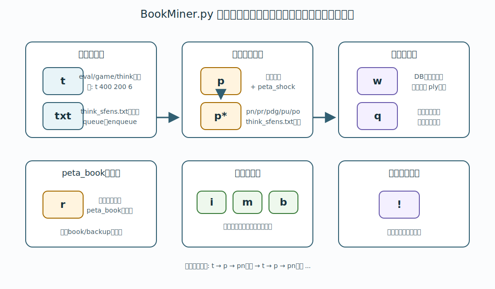

# 5. BookMiner.py の主要コマンド

BookMiner を起動すると、プロンプトに対してコマンドを入力できます。用語は [1. 用語説明](01-terms.md) で説明しています。



## `h`

ヘルプを表示します。

```text
h
```

## `sd` / `set-default`

手順2系コマンドと `e` が使う共通デフォルト値を設定します。

```text
sd 30 99999 200 6 400
```

引数は順に `eval_diff`、`max_step`、`game_ply_limit`、`book_extend_ply`、`eval_limit` です。
GUI は `peta next`、`peta refutation`、`peta depth gap`、`peta unsolved`、`peta opponent`、`enqueue` の直前にこのコマンドを送ります。

`book/think_sfens.txt` の行にメタ情報がない場合や、peta系コマンドの共通引数に `None` を指定した場合は、最後に設定した `sd` の値を使います。

## `e`

掘る局面を読み込み、探索キューへ積みます。

```text
e
```

`e` は固定で次のファイルを読みます。

```text
book/think_sfens.txt
```

入力ファイルは、1 行が 1 つの `startpos moves ...` 形式です。

行末にカンマ区切りでメタ情報を付けると、その行だけ探索条件を上書きできます。

```text
startpos moves 7g7f 3c3d, book_extend_ply=20, eval_limit=400, game_ply_limit=200
```

`book_extend_ply` は棋譜末端からの best line 延長手数、`eval_limit` は定跡木の外へ出る枝を評価値で止める上限、`game_ply_limit` は最大手数です。メタ情報が無い行、または値が `None` の行は、`sd` で設定したデフォルト値を使います。

同じ局面が複数行にある場合は、より大きいメタ情報を持つ行を採用します。数値指定は `None` より優先されます。

`e` は、入力ファイルの各行を辿り、まだ掘っていない局面をバックグラウンドの思考タスクとして投入します。この投入操作を GUI では `enqueue` と呼びます。

`e` コマンド自体には引数を指定しません。探索条件は `book/think_sfens.txt` の各行のメタ情報で指定します。

`e` コマンドで棋譜を辿るとき、定跡木の内部ノードは `eval_limit` では打ち切りません。
ただし、次の指し手が定跡木の外へ出る枝で、その評価値の絶対値がこの値を超えている場合は、その指し手の先へ進みません。
棋譜の末端まで到達できた場合は、そこから先の best line 延長でもこの値を使います。

queue は、これから探索する局面を一時的に積んでおく待ち行列です。`enqueue` は、その queue に局面を追加する操作です。queue に積まれた局面は、探索スレッドによって順に処理されます。

進捗は画面と `log/` のログで確認してください。

GUI の `enqueue進捗` は、完了したタスク数をもとに表示されます。BookMiner 起動後に enqueue した累計タスクに対して、どこまで完了したかを確認できます。複数回 enqueue した場合、分母は追加分だけ増えます。進捗ログはおおむね 10 秒ごとに、前回出力時から完了数が変わっている job について出力されます。

`settings/book_miner_settings.json5` の `max_book_ply` に到達した局面は思考しません。`game_ply_limit` の行メタ情報を指定した場合は、その行だけ指定値を使います。`book_extend_ply` を指定した場合は、その行だけ棋譜末端からの best line 延長手数を変更します。`None` は省略時と同じ意味です。

## `w`

現在の定跡 DB を、やねうら王の通常定跡形式で `book/backup/` に書き出します。

```text
w
```

出力例:

```text
book/backup/book_miner-20260607071000_12345.db
```

手数制限を付けることもできます。

```text
w 100
```

この場合、初期局面から 100 手目までの局面だけを書き出し、ファイル名に `_ply100` が付きます。

```text
book/backup/book_miner-20260607071000_12345_ply100.db
```

`_plyN` 付きのファイルは一部だけを書き出したものです。起動時の自動読み込み対象にはなりません。

書き出しは一度 `tmp-*.db` に行い、完了後に `*.db` へ置換します。書き出し途中のファイルを完成済みバックアップとして扱わないためです。

## `p`

現在の定跡 DB を peta shock 化して読み込みます。通常は現在の定跡 DB を `book/backup/` に書き出し、その書き出したファイルを peta shock 化します。

```text
p
```

`p` は、現在の定跡 DB をその場で peta shock 化し、すぐに `peta_book` として使えるようにするコマンドです。

何を変換しているのか、なぜ `peta_book` が必要なのかは [10. peta shock 化](10-peta-shock.md) を参照してください。

重要なのは、`p` は `book/backup/` の最新ファイルを探すのではなく、`p` 自身が書き出したバックアップファイル、または読み込み後に未変更であることが確認できている既存バックアップファイルを peta shock 化することです。これにより、定期自動バックアップや別の書き出しとタイミングが重なった場合でも、意図しないファイルを変換元にしにくくなります。

起動直後や `w` 直後のように、メモリ上の通常bookが最後に読み込み/保存した通常DBから変わっていない場合、`p` は通常DBを再書き出しせず、その既存ファイルを再利用します。このときログには `p command source book reused = ...` が出ます。

通常の周回作業では、BookMiner が動いている環境で `p` を使うのが基本です。

`p` で新しく通常定跡 DB を書き出した場合、通常定跡 DB と peta shock 化後の DB は、同じ timestamp と局面数を持つペアになります。既存通常DBを再利用した場合も、その通常DBに対応する `peta_book-....db` または `peta_book-....ybb` が作られます。`makebook peta_shock` は `.db -> .db` と `.ybb -> .ybb` のみ対応しているため、拡張子は変換元に揃います。

```text
book/backup/book_miner-20260607103251_14505901.db
book/backup/peta_book-20260607103251_14505901.db
```

## `r`

peta shock 化済みの `book/backup/peta_book-....db` または `book/backup/peta_book-....ybb` を読み込みます。

```text
r
```

`r` は read の略です。
`r` 自体は peta shock 化を行いません。別マシンで変換した定跡を持ち込む場合など、先に自分で `peta_book-....db` または `peta_book-....ybb` を作って `book/backup/` に置いてから使います。

path を省略した場合は、`book/backup/` にある最新の `peta_book-....db` または `peta_book-....ybb` を読みます。

読み込む peta book を明示することもできます。

```text
r book/backup/peta_book-20260607071000_12345.db
```

指定した path は、まず BookMiner.py の実行フォルダからの相対 path として解決されます。通常は BookMiner フォルダで起動するので、上のように `book/backup/...` と指定します。

次に、`book/` からの相対 path としても解決します。そのため、次の指定も同じファイルを指します。

```text
r backup/peta_book-20260607071000_12345.db
```

GUI の `peta_read` ボタンは引数なしの `r` を送るため、最新の `peta_book-....db` または `peta_book-....ybb` を読みます。外部で peta shock 化した結果を使う場合は、そのファイルを `book/backup/` に置いてから `peta_read` を押します。

このあと `pn` コマンドを使うと、次に掘る局面を列挙できます。

## `pn`

peta shock 化して読み込んだ定跡から、leaf の先へ定跡ツリーを伸ばすための局面を書き出します。

```text
pn 30
```

アルゴリズムの説明は下記のページをご覧ください。

- [10. peta shock 化](10-peta-shock.md)
- [YaneuraOu-ScriptCollection/PetaNext](../../PetaNext/README.md)

出力先:

```text
book/think_sfens-black.txt
book/think_sfens-white.txt
book/think_sfens.txt
```

第 1 引数は eval diff です。root の best move からどの程度評価値が離れた枝まで辿るかを指定します。

例えば `pn 100` は、best move から評価値が大きく離れすぎていない枝も辿って、leaf の先へ伸ばす局面を探す、という意味です。

値を大きくすると、より多くの枝を辿るので出力される局面が増えます。値を小さくすると、best move に近い枝だけを辿ります。

第 2 引数で最大 step 数(rootからの手数)を指定できます。省略または `None` 指定時は、`sd` の `max_step` を使います。

```text
pn 30 40
```

第 3 引数で最大手数を指定できます。

```text
pn 30 40 200
```

`settings/book_miner_settings.json5` の `max_book_ply` に到達する局面は、出力対象から除外されます。第 3 引数を指定した場合は、その値を使います。`None` を指定すると `sd` の `game_ply_limit` を使います。

第 4 引数で `book_extend_ply`、第 5 引数で `eval_limit` を指定できます。数値を指定すると、書き出される `book/think_sfens.txt` の各行に `book_extend_ply=...`、`eval_limit=...`、`game_ply_limit=...` が付きます。

`max_step` は `book/think_sfens.txt` に書き出されず、peta系コマンドが leaf を探す範囲だけを制限します。`game_ply_limit` は `game_ply_limit=...` として書き出されるため、後で `e` したときの探索workerにも効きます。抽出数だけを抑えたい場合は、`game_ply_limit` ではなく `max_step` を小さくしてください。

`settings/book_miner_settings.json5` の `peta_next_start_sfens_path` で指定されたファイルが存在する場合、`pn` コマンドは `startpos` ではなく、そのファイルに書かれた局面集合から辿り始めます。
`pn` コマンドは、すでにメモリ上に読み込まれている `peta_book` を辿ります。`pn` を実行しても、peta shock 化済みDBファイルを読み直すわけではありません。
詳しくは [4. 定跡を掘るための基礎](04-basics.md#peta-next-の開始局面集合を変える) を参照してください。

## peta_refutation

`peta next` と同じように peta_book を辿りますが、leaf として見つかった局面のうち、定跡から抜ける最後の1手が反駁された手だけを書き出します。

```text
pr 100 30 9999 200 None 400
```

引数は順に `eval_refutation_margin`、`eval_diff`、`max_step`、`max_book_ply`、`book_extend_ply`、`eval_limit` です。`eval_refutation_margin` の省略時は `100` です。共通引数を省略または `None` 指定した場合は `sd` の値を使います。

leaf を作る最後の1手について、peta shock 後のDBでは depth 0 の best であり、peta shock 前の通常bookでは best ではなく、次の条件を満たすものだけを `book/think_sfens.txt` へ書き出します。

```text
peta shock後の反駁候補手評価値 - peta shock後の旧best手評価値 >= eval_refutation_margin
```

通常の `peta next` では leaf が多すぎる場合に、反駁された leaf だけを優先して掘るためのコマンドです。

## peta_depth_gap

peta shock 後、`peta next` と同じように root から BFS で辿れる範囲で、best以外の登録済み指し手が best より浅く、depth差ぶん追加で掘ると best を逆転しうる場合に抽出します。

```text
pdg 0.1 30 9999 200 None 400
```

引数は順に `eval_per_ply`、`eval_diff`、`max_step`、`max_book_ply`、`book_extend_ply`、`eval_limit` です。`eval_diff` と `max_step` は `peta next` と同じ意味です。`eval_per_ply` の省略時は `0.1` です。0以上の数値を指定し、`0.5` のような小数も指定できます。共通引数を省略または `None` 指定した場合は `sd` の値を使います。
判定式は次の通りです。

```text
候補手評価値 + (best.depth - 候補手.depth) * eval_per_ply >= best評価値
```

例えば best が `eval=100 depth=10`、候補手が `eval=95 depth=1`、`eval_per_ply=1` の場合、`95 + (10 - 1) * 1 = 104` なので抽出対象です。

ただし、best の `depth` が `1000` 以上の局面は対象外です。peta shock 後の番兵値や過大な depth を、実際に読んだ手数として扱って大量抽出することを避けるためです。

出力先:

```text
book/think_sfens.txt
```

抽出された行は、候補手を指したあと、peta_book 上の best PV を depth 0 または DB 外まで辿った leaf 局面です。

## peta_unsolved

負けた棋譜などを `book/think_unsolved_sfens.txt` に入れておき、その棋譜上の各prefix局面から peta_book 上の best PV を leaf まで辿った局面を `book/think_sfens.txt` に書き出します。

```text
pu None None 200 None 400
```

引数は順に `eval_drop_limit`、`max_step`、`max_book_ply`、`book_extend_ply`、`eval_limit` です。共通引数を省略または `None` 指定した場合は `sd` の値を使います。GUIで空欄にした場合は手順2のデフォルト値行が使われ、明示的に `None` と入力した場合は `None` として送信します。

`eval_drop_limit` は、棋譜のroot局面の評価値からroot側視点でどれだけ悪化したprefixを除外するかです。`None` の場合は `99999` 扱いになり、通常は評価値差では除外しません。

`pu` は `book/think_sfens.txt` を書き出すだけです。書き出し後の `enqueue` は手動で実行してください。

## peta_opponent

過去に頒布した定跡など、対策したい相手定跡を `book/book_opponent/` に置き、現在読み込んでいる peta_book と仮想対局させます。
双方が自分の手番で best 候補を辿り、どちらかの定跡が切れた地点から現在の peta_book の PV leaf まで進めた局面を `book/think_sfens.txt` に書き出します。

```text
po 0 9999 200 20 400
```

引数は順に `eval_diff`、`max_step`、`max_book_ply`、`book_extend_ply`、`eval_limit` です。共通引数を省略または `None` 指定した場合は `sd` の値を使います。GUIで空欄にした場合は手順2のデフォルト値行が使われ、明示的に `None` と入力した場合は `None` として送信します。

```text
po None None 200 None 400
```

`eval_diff` は、各局面で best と同評価値または近い評価値の候補をどこまで辿るかです。通常は `0` で、best と同評価値の候補だけを辿ります。

`book_extend_ply`、`eval_limit`、`max_book_ply` を数値で指定すると、書き出される `book/think_sfens.txt` の各行にメタ情報が付きます。その後 `enqueue` したとき、この行メタ情報が探索条件として使われます。`None` の場合は行メタデータを付けず、`sd` のデフォルト値を使います。

Python版 BookMiner.py / BookMinerCpp ともに、`book/book_opponent/*.db` と `*.ybb` の両方を相手定跡として使えます。

## `i`

局面を問い合わせます。

```text
i startpos
```

`startpos moves ...` 形式で、指定した経路上の局面を確認することもできます。

```text
i startpos moves 7g7f 3c3d 2g2f
```

## `m`

先後反転した局面が両方登録されている場合に、片側へマージします。

```text
m
```

通常の周回作業で必ず使うコマンドではありません。

💡 先後反転した局面が両方登録されている定跡DBを開始時に用いる時にこのコマンドで修復します。

## `b`

定跡ツリーを幅優先に辿り、各局面の ply を付け直します。

```text
b
```

通常の周回作業で必ず使うコマンドではありません。

💡 各局面のplyが壊れてしまっている定跡DBを用いる時にこのコマンドで修復します。

## `q`

現在の定跡 DB を `book/backup/` に書き出して終了します。

```text
q
```

出力ファイル名には、書き出し時刻と局面数が入ります。

```text
book/backup/book_miner-20260607103251_14505901.db
```

## `!`

保存せず終了します。

```text
!
```

直前までの作業を捨てる可能性があるので、通常は `q` を使ってください。
