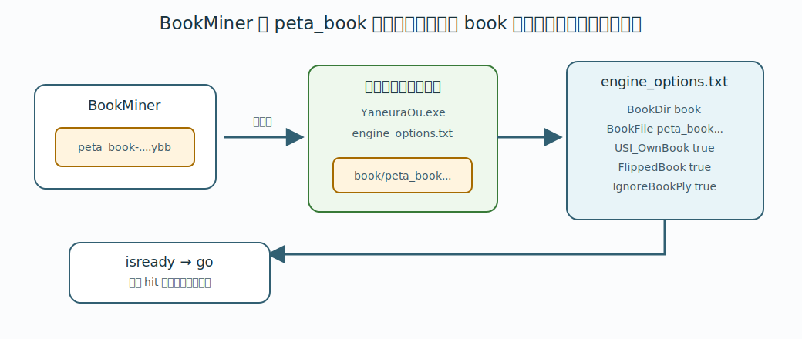

# 6. 生成された定跡をやねうら王で使うには

BookMiner で作った定跡は、やねうら王の定跡ファイルとして使えます。用語は [1. 用語説明](01-terms.md) で説明しています。

## 使うファイル

通常の BookMiner 運用では、最終的に次のファイルを使います。

```text
BookMiner/book/backup/peta_book-20260607103251_14505901.db
```

これは `p` コマンド、または外部の `makebook peta_shock` で peta shock 化された定跡です。

`w` コマンドで作られる `book/backup/book_miner-....db` もやねうら王の通常定跡形式ですが、対局用には peta shock 化後の `peta_book-....db` を使うのが基本です。

通常bookではなく peta_book を使う理由は [10. peta shock 化](10-peta-shock.md) を参照してください。



## やねうら王の book フォルダに置く

やねうら王エンジンの実行ファイルがあるフォルダに `book/` フォルダを用意し、使いたい `peta_book-....db` をコピーします。

例:

```text
YaneuraOuV940AVX2.exe
engine_options.txt
book/
  peta_book-20260607103251_14505901.db
```

`BookDir` は、やねうら王エンジンの実行ファイルがあるフォルダから見た相対パスとして扱われます。

## engine_options.txt で指定する

やねうら王系エンジンでは、実行ファイルと同じフォルダに `engine_options.txt` を置くと、`isready` 時に読み込まれます。

やねうら王のエンジンオプションについては、次のページも参考にしてください。

- [思考エンジンオプション - やねうら王Wiki](https://github.com/yaneurao/YaneuraOu/wiki/%E6%80%9D%E8%80%83%E3%82%A8%E3%83%B3%E3%82%B8%E3%83%B3%E3%82%AA%E3%83%97%E3%82%B7%E3%83%A7%E3%83%B3)

BookMiner の定跡を使う場合は、例えば次のように設定します。

```text
BookDir book
BookFile peta_book-20260607103251_14505901.db
USI_OwnBook true
FlippedBook true
IgnoreBookPly true
```

`FlippedBook` は `true` を推奨します。BookMiner が書き出す定跡では、盤面を 180 度回転させた局面は重複して書き出さないためです。

`IgnoreBookPly` も `true` を推奨します。これを設定しないと、同一局面でも手数が違う場合に定跡が hit しなくなることがあります。

他の対局用設定と組み合わせる場合は、同じ `engine_options.txt` に追記してください。

例:

```text
Threads 1
USI_Hash 1024
BookDir book
BookFile peta_book-20260607103251_14505901.db
USI_OwnBook true
FlippedBook true
IgnoreBookPly true
BookMoves 32
BookEvalDiff 30
```

## GUI から setoption で指定する

GUI や USI コンソールから指定する場合は、次のようにします。

```text
setoption name BookDir value book
setoption name BookFile value peta_book-20260607103251_14505901.db
setoption name USI_OwnBook value true
setoption name FlippedBook value true
setoption name IgnoreBookPly value true
isready
```

`readyok` が返れば、定跡ファイルの読み込み処理まで進んでいます。

## 動作確認

USI コンソールで確認する場合は、例えば次のようにします。

```text
usi
isready
position startpos
go btime 0 wtime 0 byoyomi 1000
```

定跡がヒットすれば、やねうら王は定跡手を返します。

定跡が使われていないように見える場合は、次を確認してください。

- `BookFile` が使いたい `peta_book-....db` になっているか。
- `BookDir` から見た場所に、その `peta_book-....db` があるか。
- `USI_OwnBook` が `true` になっているか。
- `FlippedBook` が `true` になっているか。
- `IgnoreBookPly` が `true` になっているか。
- `BookMoves` や `BookEvalDiff` などの条件で定跡手が弾かれていないか。
- `isready` 後のログに定跡ファイル読み込みエラーが出ていないか。
