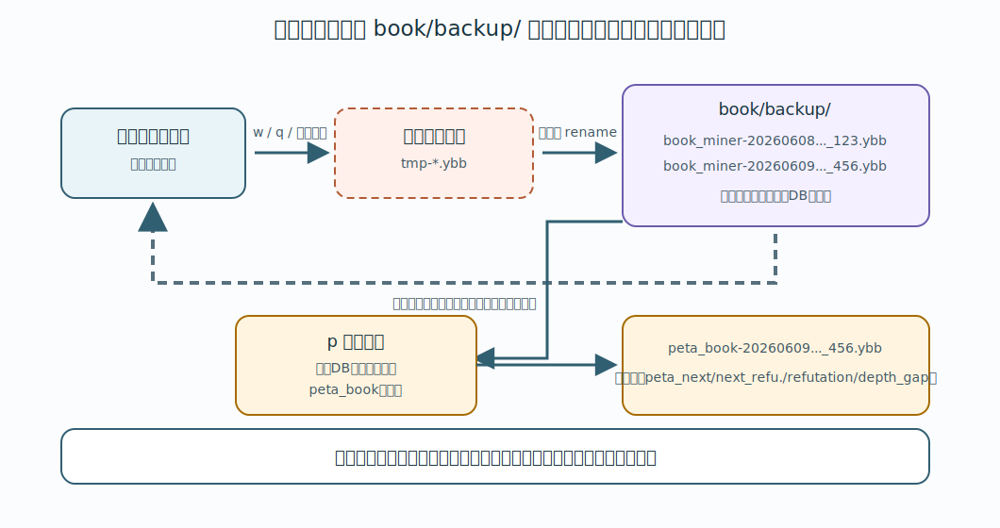

# 7. バックアップと復旧

この章では、BookMiner の通常定跡 DB の保存、定期自動バックアップ、復旧時の考え方を説明します。

## 通常定跡 DB

BookMiner の通常定跡 DB は、次のフォルダに保存されます。

```text
book/backup/
```

ファイル名は次のようになります。

```text
book/backup/book_miner-20260607103251_14505901.db
```

`20260607103251` の部分は書き出した時刻、`14505901` の部分は書き出した局面数です。

BookMiner は起動時に、`book/backup/` にある最新の通常定跡 DB を読み込みます。最新判定はファイル名に含まれるタイムスタンプ順です。`_ply100` のような `_plyN` 付きファイルは部分書き出しなので、起動時の自動読み込み対象にはなりません。

`book/backup/book_miner-....db` は BookMiner 自身が書き出した正規形の DB とみなし、起動時は高速読み込みします。この読み込みでは、先後反転局面との merge や古い評価値形式の補正は行いません。

`p` または `r` で作成される `book/backup/peta_book-....db` も、`makebook peta_shock` が出力した正規形の DB とみなし、高速読み込みします。

通常定跡 DB がまだ存在しない場合は、空の定跡として起動します。



## 終了時保存

`q` コマンドで終了すると、現在の定跡 DB を `book/backup/` に書き出してから終了します。

```text
q
```

終了時保存も、手動バックアップと同じ形式です。

```text
book/backup/book_miner-20260607103251_14505901.db
```

`!` コマンドで終了した場合は、終了時の保存は行われません。

```text
!
```

## 手動バックアップ

手動で通常定跡 DB を書き出すには `w` コマンドを使います。

```text
w
```

このコマンドは、現在の定跡 DB を `book/backup/` に書き出します。

`p` コマンドも、最初に現在の定跡 DB を `book/backup/` に書き出します。そのあと、書き出したバックアップを peta shock 化して `book/backup/peta_book-....db` として読み込みます。通常の周回作業では `p` を使うと、書き出し完了前に `r` を実行してしまう事故を避けやすくなります。

手数制限を付けた書き出しもできます。

```text
w 100
```

この場合、ファイル名に `_ply100` が付きます。

```text
book/backup/book_miner-20260607103251_14505901_ply100.db
```

`_plyN` 付きのファイルは一部だけを書き出したものです。起動時の自動読み込み対象にはなりません。

## 定期自動バックアップ

BookMiner は起動後、一定時間ごとに自動で通常定跡 DB を書き出します。

デフォルトでは 3 時間ごとです。

```json5
{
    auto_save_interval_seconds: 10800,
}
```

この値は `settings/book_miner_settings.json5` の `auto_save_interval_seconds` で変更します。単位は秒です。
まだ実設定ファイルを作っていない場合は、[settings/book_miner_settings-sample.json5](../settings/book_miner_settings-sample.json5) をコピーして `settings/book_miner_settings.json5` を作ってください。

例えば 1 時間ごとにするなら次のようにします。

```json5
{
    auto_save_interval_seconds: 3600,
}
```

30 分ごとなら次のようにします。

```json5
{
    auto_save_interval_seconds: 1800,
}
```

定跡 DB が大きい場合、書き出しには時間がかかります。短すぎる間隔にすると、探索中の負荷が増えます。

## 復旧時の考え方

BookMiner は起動時に `book/backup/` の最新の通常定跡 DB を読み込みます。

何らかの理由で最新ファイルを使いたくない場合は、BookMiner.py を終了してから、そのファイルを `book/backup/` の外へ退避してください。次回起動時には、残っている通常定跡 DB のうち最新のものが読み込まれます。

注意点:

- `_ply100` のような `_plyN` 付きのバックアップは、手数制限つきの部分書き出しです。起動時の自動読み込み対象にはなりません。
- `*.db.tmp` は書き出し途中の一時ファイルです。復旧用には使わないでください。
- コピー元のバックアップは残しておくほうが安全です。

## 書き出し途中の安全性

BookMiner の DB 書き出しは、まず `*.db.tmp` に出力し、書き出しが完了してから `.db` に置き換えます。

このため、書き出し途中で異常終了しても、完成済みの `.db` を壊しにくい作りになっています。
