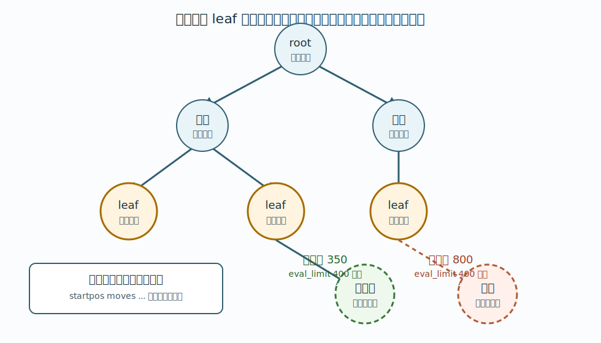
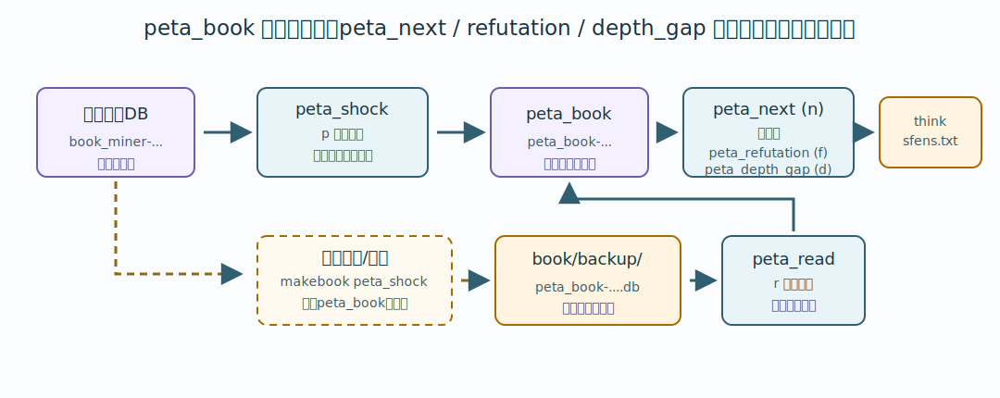

# 9. 既存のやねうら王定跡から掘り始める

この章では、既存のやねうら王標準定跡ファイルを BookMiner に読み込ませ、その定跡の leaf から先を掘り足す手順を説明します。

## 目的

既存定跡を BookMiner に読み込ませると、その定跡ツリーを出発点として使えます。

このときにやりたいことは、既存定跡の末端、つまり leaf から外へ伸ばす局面を列挙し、定跡ツリーを伸ばすことです。

探索後に再度 peta shock 化すると、既存定跡内の局面評価も、新しく伸ばした先の評価値をもとに計算し直されます。

ここでは手順を中心に説明します。peta shock 化そのものの意味、`peta_book` が必要な理由、`value` / `depth` の扱いは [10. peta shock 化](10-peta-shock.md) を参照してください。



## 既存定跡を配置する

BookMiner.py を終了してから、既存のやねうら王標準定跡ファイルを次の名前で配置します。

```text
book/backup/book_miner.db
```

例えば、既存定跡が `user_book1.db` なら、そのファイルを `book_miner.db` にリネームして、BookMiner フォルダ内の `book/backup/` に置きます。

```text
book/backup/book_miner.db
```

このファイルは、通常バックアップがまだ無い場合の読み込み入口です。

注意点:

- `book/backup/book_miner-YYYYMMDDHHMMSS_N.db` が存在する場合、BookMiner はそちらの最新ファイルを優先して読み込みます。
- 既存定跡から開始したい場合は、`book/backup/` に既存の `book_miner-*.db` が無い状態にしてください。
- `_plyN` 付きのファイルは部分書き出しなので、起動時の自動読み込み対象にはなりません。
- 持ち込む既存定跡は、やねうら王標準定跡フォーマットの `.db` ファイルである必要があります。
- `makebook peta_shock` に渡す定跡 DB は `sfen` 文字列で sort されている必要があります。BookMiner が `p` で書き出したあとの `book_miner-....db` は sort 済みです。

## BookMiner を起動する

CLI なら次のように起動します。

```bash
python3 BookMiner.py
```

GUI なら次のように起動します。

```bash
python3 BookMiner-gui.py
```

起動時に `book/backup/book_miner.db` が読み込まれます。

## 手順1. peta_book を用意して読み込む

既存定跡を読み込んだら、まず peta shock 化した定跡を BookMiner の `peta_book` として読み込みます。

BookMiner を動かしている環境でそのまま変換できる場合は、`peta_shock` を使います。

CLI:

```text
p
```

GUI:

```text
手順1. peta_shock
```

`p` コマンドは、現在メモリ上にある定跡を `book/backup/` に正規の名前で書き出し、そのファイルを peta shock 化して読み込みます。

メモリなどの都合で別マシンで peta shock 化する場合は、先に外部で `peta_book-....db` を作り、そのファイルをこの BookMiner の `book/backup/` に置いてから `r` コマンドを使います。GUI では手順1の `peta_read` ボタンがこれに対応します。

外部変換の例:

```text
makebook peta_shock backup/book_miner-20260607103251_14505901.db backup/peta_book-20260607103251_14505901.db
```

`peta_read` / `r` は変換を実行しません。すでに peta shock 化された `peta_book-....db` を読み込むだけです。

```text
r
```

```text
手順1. peta_read
```



出力例:

```text
book/backup/book_miner-20260607103251_14505901.db
book/backup/peta_book-20260607103251_14505901.db
```

この時点で、既存定跡は BookMiner の通常バックアップ形式に乗り、peta shock 化済みの `peta_book` も読み込まれています。

## 手順2. peta_next / peta_refutation / peta_depth_gap で局面を列挙する

次に、peta shock 化した定跡から leaf 局面を列挙します。

既存定跡全体の leaf を広く取りたい場合は、`eval_diff` に大きな値を指定します。

CLI:

```text
n 99999
```

GUI:

```text
手順2. peta_next  eval_diff 99999
```

`99999` は、評価値差による枝刈りを実質的に無効化するための値です。これにより、既存定跡内で辿れる枝を広く辿り、末端の局面を `book/think_sfens.txt` に書き出します。

出力先:

```text
book/think_sfens.txt
```

ただし、`max_book_ply` に到達する局面は、次に掘る局面としては書き出されません。GUIでは `game ply limit` 欄、CLIでは `l` コマンドで調整してください。

## 手順3. enqueue する

`peta_next`、`peta_refutation`、`peta_depth_gap` が書き出した `book/think_sfens.txt` を探索キューへ積みます。

CLI:

```text
e 99999
t
```

GUI:

```text
手順3. enqueue  eval_limit 99999
```

`eval_limit` も大きな値にしておくと、評価値が大きく傾いた leaf からも延長しやすくなります。

ここは既存定跡から掘り始めるときの重要な注意点です。
`peta_next` の `eval_diff` と、`enqueue` の `eval_limit` は別の値です。

`peta_next` は、peta shock 化した定跡のなかでどの枝を辿って leaf から外へ伸ばす局面を列挙するかを決めます。
一方、`enqueue` の `eval_limit` は、`book/think_sfens.txt` の各行を再生している途中で、定跡木の外へ出る枝を延長するかどうかを決める値です。

`enqueue` は `book/think_sfens.txt` の各行を先頭局面から順に再生しますが、定跡木の内部ノードの評価値では打ち切りません。
例えば平手開始局面が定跡木の内部ノードなら、その評価値が `800` で、`eval_limit 400` であっても、その局面は単に通過します。

ただし、次の指し手が定跡木の外へ出る枝で、その指し手の評価値が `eval_limit` を超えている場合、その指し手の先へは進みません。
そのため、`book/think_sfens.txt` に書かれた棋譜の末尾まで必ず辿るわけではありません。
既存定跡の leaf を広く延長したい初回は、`eval_limit 99999` のように十分大きな値を指定すると、評価値で枝を落とさずに延長できます。

通常運用では、必要に応じて `eval_limit` を小さくし、形勢が大きく傾いた leaf から先を延長しないようにします。

`enqueue` は `book/think_sfens.txt` に書かれた各行を読み、まだ掘っていない局面を探索キューへ積みます。探索キューに積まれた局面は、探索 worker によって順に処理されます。

## 必要なら peta_refutation で反駁候補を延長する

既存定跡を peta shock 化すると、もともと2番手以下だった指し手が best に入れ替わることがあります。これを BookMiner では「反駁」と呼びます。

反駁された指し手が depth 0 のままだと、その評価値は十分に延長されていない可能性があります。通常の leaf 延長に加えて、このような候補だけを重点的に掘りたい場合は `peta_refutation` を使います。

CLI:

```text
f 100 400
```

GUI:

```text
手順2. peta refutation  eval refu. 100
手順3. enqueue          eval_limit 400
```

`100` は `eval_refutation_margin` です。peta shock 前の `旧best評価値 - 反駁候補手の旧評価値` がこの値以上のものだけを抽出します。GUIでは enqueue 欄の `eval_limit` も同時に `f` コマンドへ渡し、反駁候補手の旧評価値の絶対値が `eval_limit` を超えるものは事前に除外します。

出力先は `peta_next` と同じです。

```text
book/think_sfens.txt
```

抽出後は、通常通り `enqueue` します。

```text
e 99999
t
```

## 探索後にもう一度 peta_shock 化する

enqueue したタスクが処理されたら、もう一度 peta shock 化します。

CLI:

```text
p
```

GUI:

```text
手順1. peta_shock
```

これにより、新しく探索された leaf の評価値をもとに、peta shock 化された定跡が作り直されます。
別環境で peta shock 化済みの `peta_book-....db` を作った場合は、そのファイルを `book/backup/` に置いてから `peta_read` を使います。

このあとさらに広げたい場合は、次の手順を繰り返します。

```text
手順1. peta_shock または 外部変換後の peta_read
手順2. peta_next  eval_diff 99999
        または peta refutation eval refu. 100
        または peta depth_gap eval/ply 1
手順3. enqueue    eval_limit 99999
```

通常運用では、既存定跡から初回の延長をしたあと、`eval_diff` や `eval_limit` を目的に応じて小さくしていきます。
