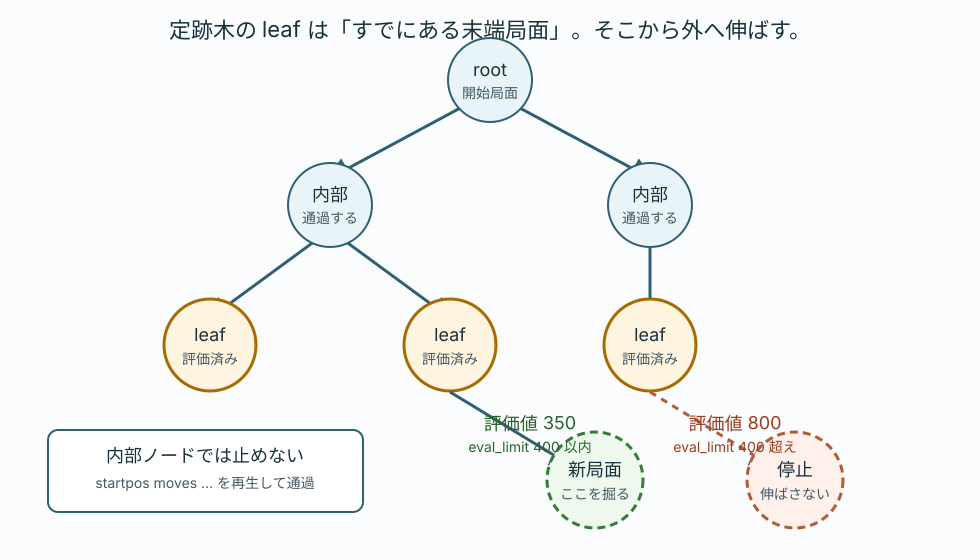
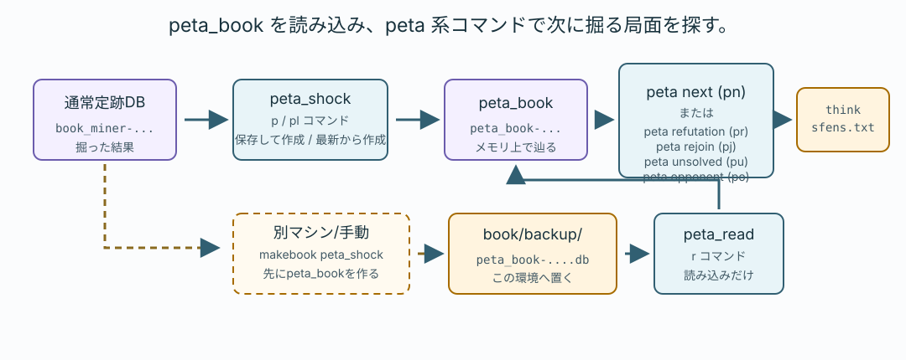

# 9. 既存のやねうら王定跡から掘り始める

この章では、既存のやねうら王標準定跡ファイルを BookMiner に読み込ませ、その定跡の leaf から先を掘り足す手順を説明します。

## 目的

既存定跡を BookMiner に読み込ませると、その定跡ツリーを出発点として使えます。

このときにやりたいことは、既存定跡の末端、つまり leaf から外へ伸ばす局面を列挙し、定跡ツリーを伸ばすことです。

探索後に再度 peta shock 化すると、既存定跡内の局面評価も、新しく伸ばした先の評価値をもとに計算し直されます。

ここでは手順を中心に説明します。既存定跡全体の leaf の先を評価値で絞らずに掘る場合、peta shock 化は不要です。peta shock 化そのものの意味、`peta_book` が必要な理由、`value` / `depth` の扱いは [10. peta shock 化](10-peta-shock.md) を参照してください。peta book から次に掘る局面を作る操作の詳細は [11. peta book を使って次に掘る局面を作る](11-peta-operations.md) を参照してください。



## 既存定跡を配置する

BookMiner.py を終了してから、既存のやねうら王標準定跡ファイルを配置します。もっとも簡単な方法は、次の名前で置くことです。

```text
book/backup/book_miner.db
```

例えば、既存定跡が `user_book1.db` なら、そのファイルを `book_miner.db` にリネームして、BookMiner フォルダ内の `book/backup/` に置きます。

```text
book/backup/book_miner.db
```

このファイルは、通常バックアップがまだ無い場合の読み込み入口です。

注意点:

- `book/backup/book_miner-YYYYMMDDHHMMSS_N.db` または既存の `.ybb` が存在する場合、BookMiner はそちらの最新ファイルを優先して読み込みます。
- 既存定跡から開始したい場合は、`book/backup/` に既存の `book_miner-*` バックアップが無い状態にしてください。
- `_plyN` 付きのファイルは部分書き出しなので、起動時の自動読み込み対象にはなりません。
- 初回の読み込み入口として `book_miner.db` を使う場合、持ち込む既存定跡はやねうら王標準定跡フォーマットの `.db` ファイルである必要があります。
- 既存の `.ybb` をそのまま使う場合は、`book/backup/book_miner-YYYYMMDDHHMMSS_N.ybb` のような通常バックアップ名で置いてください。`N` は局面数です。
- `makebook peta_shock` に渡す定跡 DB は `sfen` 文字列で sort されている必要があります。BookMiner が `p` で書き出したあとの `book_miner-....db` は sort 済みです。

## BookMiner を起動する

CLI なら次のように起動します。

```bash
python3 BookMiner.py
```

GUI なら次のように起動します。

```bash
python3 BookMiner-gui.py
```

起動時に `book/backup/` の通常バックアップが読み込まれます。通常バックアップが無い場合は、`book/backup/book_miner.db` が読み込まれます。

## 手順1. 既存定跡の leaf の先を列挙する

既存定跡全体の leaf の先を評価値で絞らずに掘る場合は、`makebook/book_to_think_sfens.py` を使います。

このスクリプトは、やねうら王定跡DBの候補手を辿り、子局面が定跡DB内に1つも存在しない book leaf 局面までの手順を `book/think_sfens.txt` に書き出します。評価値を見ないので、入力DBが peta shock 化されている必要はありません。

デフォルトでは、leaf 局面に登録されている指し手は出力手順に含めません。leaf の各候補手を1手指した先、つまり定跡DBの外へ出た局面まで出力したい場合だけ `--include-leaf-moves` を指定します。

`YaneuraOu-ScriptCollection` をカレントフォルダにして実行します。

```bash
python3 makebook/book_to_think_sfens.py BookMiner/book/backup/book_miner.db BookMiner/book/think_sfens.txt
```

入力は `.db` / `.ybb` のどちらでも構いません。ただし、このスクリプトに渡す入力DBは、BookMinerが通常bookとして読み込んでいるものと同じ内容にしてください。BookMiner側が空bookや別bookを読んでいる状態で `enqueue` すると、`think_sfens.txt` の手順を既存定跡上で正しく辿れません。

```bash
python3 makebook/book_to_think_sfens.py BookMiner/book/backup/book_miner-20260809000000_123456.ybb BookMiner/book/think_sfens.txt
```

出力先を省略した場合は、`BookMiner/book/think_sfens.txt` に書き出します。

```bash
python3 makebook/book_to_think_sfens.py BookMiner/book/backup/book_miner.db
```

開始局面を限定したい場合は、`--roots` に `startpos moves ...` 形式または `sfen ... moves ...` 形式のファイルを指定します。

```bash
python3 makebook/book_to_think_sfens.py BookMiner/book/backup/book_miner.db --roots roots.txt
```

通常は同一局面への重複経路を1つにまとめ、180度反転した局面も同一視して定跡DBを引きます。反転局面を同一視したくない場合は `--no-flip-lookup` を指定します。

出力先:

```text
BookMiner/book/think_sfens.txt
```

## 評価値で絞りたい場合: peta_book を用意して読み込む

既存定跡を読み込んだら、まず peta shock 化した定跡を BookMiner の `peta_book` として読み込みます。

BookMiner を動かしている環境でそのまま変換できる場合は、`peta_shock` を使います。直前に保存済みの `book/backup/book_miner-....db` または `.ybb` をそのまま使う場合は、DBを書き出さない `peta_shock_latest` も使えます。

CLI:

```text
p
```

GUI:

```text
手順1. peta_shock
```

`p` コマンドは、現在メモリ上にある定跡を `book/backup/` に正規の名前で書き出し、そのファイルを peta shock 化して読み込みます。

```text
pl
```

```text
手順1. peta_shock_latest
```

`pl` / `peta_shock_latest` は、現在メモリ上の定跡を書き出さず、`book/backup/` の最新通常bookから peta shock 化します。

メモリなどの都合で別マシンで peta shock 化する場合は、先に外部で `peta_book-....db` または `.ybb` を作り、そのファイルをこの BookMiner の `book/backup/` に置いてから `r` コマンドを使います。GUI では手順1の `peta_read` ボタンがこれに対応します。

外部変換の例:

```text
makebook peta_shock backup/book_miner-20260607103251_14505901.db backup/peta_book-20260607103251_14505901.db
```

`peta_read` / `r` は変換を実行しません。すでに peta shock 化された `peta_book-....db` または `peta_book-....ybb` を読み込むだけです。

```text
r
```

```text
手順1. peta_read
```



出力例:

```text
book/backup/book_miner-20260607103251_14505901.db
book/backup/peta_book-20260607103251_14505901.db
```

この時点で、既存定跡は BookMiner の通常バックアップ形式に乗り、peta shock 化済みの `peta_book` も読み込まれています。

## 評価値で絞りたい場合: peta next / peta refutation / peta rejoin / peta unsolved / peta opponent で局面を列挙する

次に、peta shock 化した定跡から leaf 局面を列挙します。

評価値を使って候補を絞りたい場合は、`peta next` などの peta 系コマンドを使います。

CLI:

```text
pn 99999
```

GUI:

```text
手順2. peta next  eval_diff 99999
```

`99999` は、評価値差による枝刈りをかなり広くするための値です。ただし `peta next` は手番側では bestmove だけを辿るため、これを指定しても定跡DBの全leaf列挙にはなりません。全候補手を評価値無視で辿りたい場合は、前節の `book_to_think_sfens.py` を使います。

出力先:

```text
book/think_sfens.txt
```

ただし、`game_ply_limit` に到達する局面は、次に掘る局面としては書き出されません。GUIでは各 peta 操作行の `game ply limit` 欄、CLIでは `pn` / `pr` / `pj` / `pu` / `po` コマンドの引数で調整してください。

`game ply limit` は `book/think_sfens.txt` の行末メタ情報としても残るため、その後の `enqueue` の探索workerにも効きます。候補列挙だけを浅くしたい場合は `game ply limit` ではなく `max step` を調整してください。`max step` は `book/think_sfens.txt` に書き出されません。

## 手順2. enqueue する

`book_to_think_sfens.py`、または `peta next`、`peta refutation`、`peta rejoin`、`peta unsolved`、`peta opponent` が書き出した `book/think_sfens.txt` を探索キューへ積みます。

CLI:

```text
sd 99999 99999 200 6 99999
e
```

GUI:

```text
手順2. デフォルト値  eval_diff 99999  max step 99999  game ply limit 200  book extend ply 6  eval_limit 99999
手順3. enqueue
```

`book_to_think_sfens.py` が出力する行には、`book_extend_ply=...` や `eval_limit=...` の行メタ情報は付きません。そのため、`enqueue` 時には `sd` のデフォルト値、または GUI の `デフォルト値` 行が使われます。

デフォルト値または peta 系出力時の `eval_limit` を大きな値にしておくと、評価値が大きく傾いた leaf からも延長しやすくなります。

ここは既存定跡から掘り始めるときの重要な注意点です。
`peta next` の `eval_diff` と、手順2の行メタ情報として書き出す `eval_limit` は別の値です。

`peta next` は、peta shock 化した定跡のなかでどの枝を辿って leaf から外へ伸ばす局面を列挙するかを決めます。
一方、手順2から `book/think_sfens.txt` の各行に書き込まれる `eval_limit` は、enqueue 時にその行を再生している途中で、定跡木の外へ出る枝を延長するかどうかを決める値です。

`enqueue` は `book/think_sfens.txt` の各行を先頭局面から順に再生しますが、定跡木の内部ノードの評価値では打ち切りません。
例えば平手開始局面が定跡木の内部ノードなら、その評価値が `800` で、`eval_limit 400` であっても、その局面は単に通過します。

ただし、次の指し手が定跡木の外へ出る枝で、その指し手の評価値が `eval_limit` を超えている場合、その指し手の先へは進みません。
そのため、`book/think_sfens.txt` に書かれた棋譜の末尾まで必ず辿るわけではありません。
既存定跡の leaf を広く延長したい初回は、`eval_limit 99999` のように十分大きな値を指定すると、評価値で枝を落とさずに延長できます。

通常運用では、必要に応じて `eval_limit` を小さくし、形勢が大きく傾いた leaf から先を延長しないようにします。

`enqueue` は `book/think_sfens.txt` に書かれた各行を読み、まだ掘っていない局面を探索キューへ積みます。探索キューに積まれた局面は、探索 worker によって順に処理されます。

## 必要なら peta refutation で反駁 leaf を延長する

既存定跡を peta shock 化すると、もともと2番手以下だった指し手が best に入れ替わることがあります。これを BookMiner では「反駁」と呼びます。

反駁された指し手が depth 0 のままだと、その評価値は十分に延長されていない可能性があります。通常の leaf 延長のうち、このような候補だけを重点的に掘りたい場合は `peta refutation` を使います。

CLI:

```text
pr 100 99999 9999 200 None 400
```

GUI:

```text
手順2. peta refutation  eval refu. 100  eval_diff 99999  eval_limit 400
手順3. enqueue
```

`100` は `eval_refutation_margin`、`99999` は `eval_diff`、`9999` は `max_step`、`200` は `game_ply_limit` です。peta shock 後の `反駁候補手評価値 - 旧best手評価値` がこの値以上の leaf だけを抽出します。

出力先は `peta next` と同じです。

```text
book/think_sfens.txt
```

## peta next の leaf から反駁されたものだけを掘る

通常の `peta next` では候補が多すぎる場合、`peta refutation` を使うと、`peta next` の leaf のうち、定跡から抜ける最後の1手が反駁された手だったものだけを書き出せます。

CLI:

```text
pr 100 99999 9999 200 None 400
```

GUI:

```text
手順2. peta refutation  eval refu. 100  eval_diff 99999  max step 9999  game ply limit 200  eval_limit 99999
```

`100` は `eval_refutation_margin` です。peta shock 後の `反駁候補手評価値 - 旧best手評価値` がこの値以上の leaf だけを抽出します。

抽出後は、通常通り `enqueue` します。

```text
e
```

## 探索後にもう一度 peta_shock 化する

enqueue したタスクが処理されたら、もう一度 peta shock 化します。

CLI:

```text
p
```

GUI:

```text
手順1. peta_shock
```

これにより、新しく探索された leaf の評価値をもとに、peta shock 化された定跡が作り直されます。
別環境で peta shock 化済みの `peta_book-....db` または `peta_book-....ybb` を作った場合は、そのファイルを `book/backup/` に置いてから `peta_read` を使います。

このあとさらに広げたい場合は、次の手順を繰り返します。

```text
手順1. peta_shock または peta_shock_latest または 外部変換後の peta_read
手順2. デフォルト値 eval_diff 99999 max step 99999 game ply limit 200 book extend ply 6 eval_limit 99999
        peta next
        または peta refutation eval_diff 99999 eval refu. 100
        または peta rejoin eval_diff 99999
        または peta unsolved eval_drop_limit None
        または peta opponent eval_diff 0 book extend ply 20
手順3. enqueue
```

通常運用では、既存定跡から初回の延長をしたあと、`eval_diff` や `eval_limit` を目的に応じて小さくしていきます。
