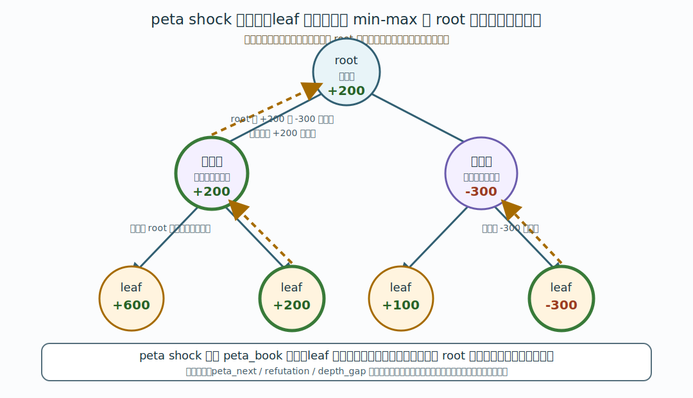

# 10. peta shock 化

この章では、BookMiner の運用で出てくる `peta_shock`、`peta_read`、`peta_next`、`peta_next_refutation`、`peta_next_gap`、`peta_unsolved`、`peta_opponent` が何をしているのか、なぜ必要なのかを説明します。

## peta shock 化とは

peta shock 化は、やねうら王の `makebook peta_shock` コマンドで通常定跡 DB を変換する処理です。

BookMiner が探索して書き出す `book_miner-....ybb` は、各局面をエンジンで調べた結果を集めた通常定跡 DB です。leaf 側には探索結果がありますが、root 側の指し手の評価値が、その先の定跡木全体を最善に進めた結果をまだ十分に反映していないことがあります。

peta shock 化は、定跡木を後ろから辿り、leaf の評価値を min-max で親局面へ伝播させます。変換後の `peta_book-....ybb` では、内部ノードの指し手評価値が、その指し手で進んだ先の最善応手を踏まえた値に更新されます。



## なぜ必要なのか

BookMiner は定跡を一度に完成させるのではなく、次の周回を繰り返して定跡木を伸ばします。

```text
1. 通常bookを peta shock 化して peta_book を作る
2. peta_book を peta_next、peta_next_refutation、peta_next_gap、peta_unsolved、peta_opponent のいずれかで辿り、次に掘る局面を book/think_sfens.txt に書き出す
3. book/think_sfens.txt を enqueue して探索する
4. 探索結果で通常bookが増える
5. もう一度 peta shock 化する
```

peta shock 化せずに通常bookだけを見ると、途中局面の評価値が古いままになり、どの枝を次に伸ばすべきかを判断しにくくなります。peta shock 化すると、末端までの結果が root 側へ戻ってくるため、`peta_next` が「定跡木全体を見たうえで次に掘る候補」を選びやすくなります。

一方で、peta shock 化によって、もともと2番手以下だった指し手が best に入れ替わることがあります。BookMiner ではこれを「反駁」と呼びます。反駁された指し手が depth 0 のままだと、その評価値はまだ十分に延長されていない可能性があり、root 側へ強いノイズとして戻ることがあります。通常の leaf 延長の中で反駁された leaf だけを優先する場合は `peta_next_refutation` を使います。また、best に近い評価値だが depth が浅い候補手を延長するために `peta_next_gap` を使います。負けた棋譜の変化周辺を重点的に延長したい場合は `peta_unsolved` を使います。過去に頒布した定跡をそのまま使ってくる相手を想定して対策候補を掘りたい場合は `peta_opponent` を使います。

対局用に使う定跡も、基本的には peta shock 化後の `peta_book-....ybb` を使います。

## 通常bookとpeta_book

BookMiner の運用では、主に次の2種類の DB が出てきます。

| ファイル | 役割 |
|---|---|
| `book/backup/book_miner-....ybb` | BookMiner が探索結果を保存する通常定跡 DB。次に探索するときの元データです。 |
| `book/backup/peta_book-....ybb` | 通常定跡 DB を peta shock 化した DB。`peta_next`、`peta_next_refutation`、`peta_next_gap`、`peta_unsolved`、`peta_opponent`、対局用の基本入力です。 |

`peta_book-....ybb` は派生物です。通常bookを更新したあとに古い `peta_book-....ybb` を使い続けると、新しく掘った評価値が反映されません。探索後は、再度 peta shock 化して新しい `peta_book-....ybb` を作ります。既存の `.db` 形式も読み込みはできますが、新規書き出しは `.ybb` です。

## BookMinerの各コマンド

BookMiner の GUI ボタンと CLI コマンドは次の対応です。

| GUI | CLI | 内容 |
|---|---|---|
| `peta_shock` | `p` | 現在の通常bookを peta shock 化して、生成された `peta_book-....ybb` を読み込みます。通常bookが未変更なら既存DBを再利用し、変更済みなら書き出してから変換します。 |
| `peta_read` | `r` | すでに存在する `peta_book-....ybb` または既存 `.db` を読み込みます。peta shock 化自体は行いません。 |
| `peta_next` | `pn eval_diff [max_step] [max_book_ply] [book_extend_ply]` | 読み込み済みの peta_book を辿り、次に掘る候補を `book/think_sfens.txt` に書き出します。 |
| `peta next refu.` | `pnf eval_diff [eval_refutation_margin] [max_step] [max_book_ply] [book_extend_ply]` | `peta_next` の leaf のうち、元DBでは best ではなかった反駁leafだけを `book/think_sfens.txt` に書き出します。 |
| `peta next gap` | `png eval_diff [eval_per_ply] [max_step] [max_book_ply] [book_extend_ply]` | `peta_next` と同じ範囲で、best以外の候補手がbestより浅く、depth差ぶん延長すると逆転しうる場合に、そのPV leafを `book/think_sfens.txt` に書き出します。 |
| `peta unsolved` | `pu [eval_diff] [max_step] [max_book_ply] [book_extend_ply]` | `book/think_unsolved_sfens.txt` の棋譜prefixから peta_book 上の best PV leaf を `book/think_sfens.txt` に書き出します。 |
| `peta opponent` | `po [eval_diff] [max_step] [max_book_ply] [book_extend_ply]` | `book/book_opponent/` に置いた相手定跡と現行 peta_book の best 進行を辿り、対策候補leafを `book/think_sfens.txt` に書き出します。 |
| `enqueue` | `t eval_limit [max_book_ply] [book_extend_ply]` | `book/think_sfens.txt` を探索 queue に積みます。 |

通常は `peta_shock` → `peta_next` → `enqueue` を繰り返します。通常の leaf 延長のうち反駁されたものだけを優先したい場合は `peta next refu.`、best に近いが浅すぎる候補を延長したい場合は `peta next gap`、負けた棋譜の周辺を重点的に掘る場合は `peta unsolved`、過去配布定跡への対策候補を掘る場合は `peta opponent` を使います。メモリや時間の都合で別マシンで peta shock 化する場合は、外部で作った `peta_book-....ybb` を `book/backup/` に置き、`peta_read` → `peta_next` / `peta next refu.` / `peta next gap` / `peta unsolved` / `peta opponent` → `enqueue` と進めます。

`peta_shock` は、起動時に読み込んだ通常DB、または最後に `w` / 自動保存で書き出した通常DBからメモリ内容が変わっていなければ、その既存DBを変換元として再利用します。追加で掘っていないのに同じ内容の `book_miner-....ybb` を増やさないためです。


## 直接実行する場合

やねうら王側のコマンド形式は次の通りです。

```text
makebook peta_shock <readbook> <writebook> [shrink] [fast]
```

`readbook` と `writebook` は、エンジンオプション `BookDir` からの相対パスです。

| オプション | 意味 |
|---|---|
| `shrink` | 最善手と同じ評価値の指し手以外を削除して、出力される定跡ファイルを小さくします。次に掘る候補を広く列挙したい BookMiner 運用では通常使いません。 |
| `fast` | テンポラリファイルを書き出さずに高速化します。ただし、メモリ使用量は増えます。 |

BookMiner の `p` コマンドは、内部的には `YO-MATERIAL.exe` におおむね次のようなコマンドを送ります。

```text
setoption name BookDir value book
setoption name BookFile value no_book
setoption name FlippedBook value true
setoption name USI_Hash value 1
makebook peta_shock backup/book_miner-YYYYMMDDHHMMSS_N.ybb backup/tmp-peta_book-YYYYMMDDHHMMSS_N.ybb
quit
```

変換に成功すると、BookMiner は `tmp-peta_book-....ybb` を正式な `peta_book-....ybb` に置き換えます。変換途中のファイルを完成済みの peta_book として扱わないためです。

## value / depth の伝播

peta shock 化済み DB では、ある親局面 `P` の指し手 `m` で進めた子局面 `C` が同じ DB 内に存在する場合、原則として `m` の `(value, depth)` は、子局面 `C` の best move から次のように決まります。

```text
P の m.value = - C の best.value
P の m.depth = min(C の best.depth + 1, 9999)
```

評価値を反転するのは、手番が入れ替わるためです。子局面で相手から見て良い値は、親局面の手番側から見ると悪い値になります。

子局面 `C` が DB 内に存在しない枝は leaf です。この場合、その指し手の `(value, depth)` は入力 DB にあった探索結果を保持します。

## 同評価値・depth違いの `value - 1`

同じ親局面内で、best move と同じ評価値だが depth が異なる指し手がある場合、best 以外の指し手は書き出し時に `value` を1だけ下げることがあります。

これは仕様です。千日手絡みなどで、評価値は同じだが遠回りしている手順があると、depth の比較によって迂回手順を選び続けることがあります。そこで、同評価値・depth違いの非best手は `value - 1` して、同じ評価値の候補として選ばれ続けにくくしています。

実装上は、やねうら王の `source/book/makebook2025.cpp` で次の条件に該当する指し手を補正しています。

```text
best move と value が同じ
best move と depth が異なる
best move ではない
```

このため、peta shock 化済み DB を PV として辿ると、途中で評価値が1だけ変わったように見えることがあります。これは、上記条件に該当する限り不整合ではありません。

## peta_next_refutation

`peta_next_refutation` は、`peta_next` と同じように root から peta_book を辿り、leaf の先へ伸ばす局面を探します。ただし、leaf として見つかった局面のうち、定跡から抜ける最後の1手が反駁された手だけを出力します。

GUIでは `peta next refu.`、CLIでは `pnf` コマンドです。

```text
pnf 30 100 9999 200 None
```

引数は `eval_diff eval_refutation_margin max_step max_book_ply book_extend_ply` の順です。GUIでは `peta_next` と `peta next refu.` で `max step` を別々に指定できます。空欄なら `None` が送信され、CLI側でデフォルト値が使われます。

判定式は次の通りです。

```text
peta shock後の反駁候補手評価値 - peta shock後の旧best手評価値 >= eval_refutation_margin
```

`peta_next_refutation` は `peta_next` の探索範囲に入った leaf だけを対象にします。通常の `peta_next` では候補が多すぎるが、反駁された leaf を優先して延長したい場合に使います。

## peta_next_gap

`peta_next_gap` は、`peta_next` と同じように root から peta_book を BFS で辿ります。その到達範囲内で、best以外の登録済み指し手が best より浅く、depth差ぶん延長すれば best を逆転しうる場合に抽出します。

GUIでは `peta next gap`、CLIでは `png` コマンドです。

```text
png 30 0.1 9999 200 None
```

引数は `eval_diff eval_per_ply max_step max_book_ply book_extend_ply` の順です。`eval_diff` と `max_step` は `peta_next` と同じ意味です。`None` を指定するとデフォルト値を使います。

判定式は次の通りです。

```text
候補手評価値 + (best.depth - 候補手.depth) * eval_per_ply >= best評価値
```

例えば peta shock 後に best が `eval=100 depth=10`、候補手が `eval=95 depth=1` だった場合、depth差は `9` です。`eval_per_ply=1` なら `95 + 9 = 104` となるため、その候補手をさらに掘る価値があるものとして抽出します。`eval_per_ply` には `0.5` のような小数も指定できます。

ただし、best の `depth` が `1000` 以上の局面は対象外です。peta shock 後の番兵値や過大な depth を、実際に読んだ手数として扱って大量抽出することを避けるためです。

`peta_next_gap` は条件を満たした候補手を指したあと、peta_book 上の best PV を depth 0 または DB 外まで辿り、そのPV leafを `book/think_sfens.txt` に書き出します。GUI の `peta next gap` ボタンは `png eval_diff eval_per_ply max_step max_book_ply book_extend_ply` に対応します。

## peta_unsolved

`peta_unsolved` は、`book/think_unsolved_sfens.txt` に書いた棋譜の各prefix局面について、peta_book 上の best PV を leaf まで辿り、そのleaf局面を `book/think_sfens.txt` に書き出します。

GUIでは `peta unsolved`、CLIでは `pu` コマンドです。

```text
pu None None 200 None
```

引数は `eval_diff max_step max_book_ply book_extend_ply` の順です。`None` を指定するとデフォルト値を使います。`eval_diff` は棋譜rootの評価値からroot側視点でどれだけ悪化したprefixを除外するかで、`None` の場合は `99999` 扱いです。

`peta_unsolved` は `book/think_sfens.txt` を書き出すだけで、自動的には enqueue しません。負けた棋譜の変化周辺を確認してから、手動で `enqueue` します。

## peta_opponent

`peta_opponent` は、過去に頒布した定跡などを仮想敵として使い、その定跡をそのまま使ってくる相手への対策候補を作るための処理です。

相手定跡は次のフォルダに置きます。

```text
book/book_opponent/
```

Python版 BookMiner.py / BookMinerCpp ともに、相手定跡として `.db` と `.ybb` の両方を読みます。

GUIでは `peta opponent`、CLIでは `po` コマンドです。

```text
po 0 9999 200 20
```

引数は `eval_diff max_step max_book_ply book_extend_ply` の順です。`eval_diff` は各局面で best からどれくらい評価値が離れた候補まで辿るかです。通常は `0` で、best と同評価値の候補だけを辿ります。

`peta_opponent` は、現在読み込んでいる peta_book と相手定跡を、手番に応じて交互に辿ります。どちらかの定跡が切れた局面を見つけたら、そこから現在の peta_book の PV leaf まで進め、その leaf 局面を `book/think_sfens.txt` に書き出します。DFS ではなく BFS で辿るため、分岐と合流を繰り返す定跡でも手順組み合わせを過剰に膨らませにくい作りです。

各 peta 抽出コマンドの `book_extend_ply` を数値で指定すると、書き出し行は次の形式になります。

```text
startpos moves 7g7f 3c3d, book_extend_ply=20
```

この行を `enqueue` した場合、手順3の `book extend ply` ではなく、行ごとの `book_extend_ply` が使われます。`book_extend_ply=None` の場合はメタ情報を書かず、通常通り `enqueue` 側の `book extend ply` を使います。同じ局面が複数の手順2から出た場合、自動enqueueの集約では `book_extend_ply` が大きい行を残します。

## eval_diff と eval_limit

`peta_next` / `peta_next_refutation` / `peta_next_gap` / `peta_unsolved` / `peta_opponent` の `eval_diff`、`peta_next_refutation` の `eval_refutation_margin`、`peta_next_gap` の `eval_per_ply`、`enqueue` の `eval_limit`、手順2各行の `book_extend_ply` は別の値です。

| 値 | 使う場所 | 意味 |
|---|---|---|
| `eval_diff` | `peta_next` / `pn`、`peta_next_refutation` / `pnf`、`peta_next_gap` / `png`、`peta_unsolved` / `pu`、`peta_opponent` / `po` | peta_book の中で、root の best move からどれくらい評価値が離れた枝まで辿るか。`peta_unsolved` では棋譜rootからどれくらい悪化したprefixを除外するか。`peta_opponent` では各局面で best に近い候補をどこまで辿るか。 |
| `eval_refutation_margin` | `peta_next_refutation` / `pnf` | peta shock後の反駁候補手と旧best手の評価値差がどれくらい以上なら抽出するか。 |
| `eval_per_ply` | `peta_next_gap` / `png` | bestとのdepth差1手あたり、候補手の評価値がどれくらい改善しうると仮定するか。 |
| `eval_limit` | `enqueue` / `t` | `book/think_sfens.txt` を再生するとき、定跡木の外へ出る枝を評価値で止めるか。 |
| `book_extend_ply` | 手順2の各 peta 抽出コマンド、`enqueue` / `t` | `book/think_sfens.txt` の行ごとに、棋譜末端から best line を何手分延長するかを上書きする値。指定がなければ `enqueue` 側の `book extend ply` を使います。 |

既存定跡から広く掘り始める初回は、`eval_diff 99999` と `eval_limit 99999` のように大きな値を使うと、評価値による枝刈りをほぼ無効化できます。通常運用では、目的に応じてこれらを小さくし、形勢が大きく傾いた枝を広げすぎないようにします。

## MATERIAL版を使う理由

peta shock 化には、探索用の強いエンジンではなく MATERIAL 版のやねうら王を使います。peta shock 化は定跡 DB の変換処理であり、評価関数ファイルを使って局面を深く探索する処理ではありません。

MATERIAL 版は評価関数ファイルを必要とせず、メモリ使用量が小さいため、大きな定跡 DB を変換する用途に向いています。

## 運用上の注意

- `peta_read` は変換を実行しません。外部で作った `peta_book-....ybb` または既存の `.db` を読み込むだけです。
- `peta_next`、`peta_next_refutation`、`peta_next_gap`、`peta_unsolved`、`peta_opponent` はメモリ上に読み込まれている peta_book を辿ります。DB ファイルを毎回読み直すわけではありません。
- 通常bookを探索で増やしたあとは、古い peta_book ではなく、新しく peta shock 化した peta_book を使います。
- `makebook peta_shock` に渡す通常定跡 DB は sort 済みである必要があります。BookMiner が `p` で書き出した `book_miner-....ybb` はそのまま使えます。
