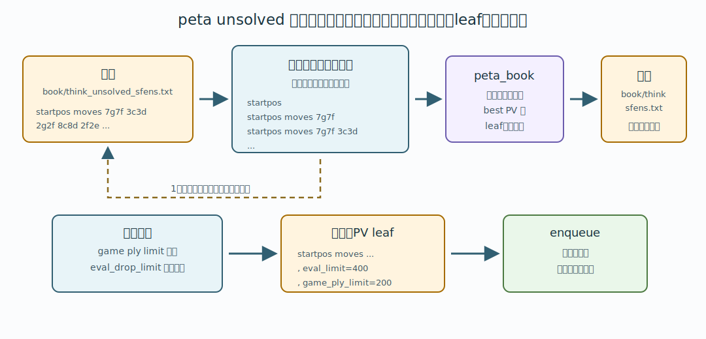

# 11. peta book を使って次に掘る局面を作る

この章では、peta shock 化済みの peta book を使って、次に掘る局面を `book/think_sfens.txt` に書き出す操作を説明します。

peta shock 化そのものは前章で説明しています。

- [10. peta shock 化](10-peta-shock.md)

## 共通の流れ

peta 系コマンドは、読み込み済みの peta book を辿って `book/think_sfens.txt` を作ります。そのあと `enqueue` すると、BookMiner は `book/think_sfens.txt` を通常book上で再生し、まだ掘っていない局面を探索 queue に積みます。

```text
peta_book を読む
  ↓
peta next / peta refutation / peta depth gap / peta unsolved / peta opponent
  ↓
book/think_sfens.txt を作る
  ↓
enqueue
  ↓
通常book上で局面を辿り、必要な局面を探索する
```

ここで重要なのは、peta 系コマンドが辿る DB と、enqueue 後に探索 worker が辿る DB は別だという点です。

- peta 系コマンドは、メモリ上に読み込まれている peta book を辿ります。
- enqueue は、`book/think_sfens.txt` を通常book上で辿ります。
- `book_extend_ply` は enqueue 後の通常book側で使われます。peta book をさらに何手辿るかではありません。


## コマンド一覧

| GUI | CLI | 内容 |
|---|---|---|
| `peta_shock` | `p` | 通常bookを peta shock 化して、その peta book を読み込みます。詳細は [10. peta shock 化](10-peta-shock.md) を参照してください。 |
| `peta_shock_latest` | `pl` | 現在DBを保存せず、`book/backup/` の最新通常bookを peta shock 化して読み込みます。 |
| `peta_read` | `r` | すでに存在する `peta_book-....db` または `peta_book-....ybb` を読み込みます。 |
| `デフォルト値` | `sd eval_diff max_step game_ply_limit book_extend_ply eval_limit` | peta 系コマンドと `enqueue` が `None` や行メタ情報なしで使う共通デフォルト値を設定します。 |
| `peta next` | `pn eval_diff [max_step] [game_ply_limit] [book_extend_ply] [eval_limit]` | peta book を root から辿り、leaf の先へ伸ばす候補を `book/think_sfens.txt` に書き出します。 |
| `peta refutation` | `pr eval_refutation_margin [eval_diff] [max_step] [game_ply_limit] [book_extend_ply] [eval_limit]` | `peta next` の leaf のうち、反駁された leaf だけを書き出します。 |
| `peta depth gap` | `pdg eval_per_ply [eval_diff] [max_step] [game_ply_limit] [book_extend_ply] [eval_limit]` | `peta next` と同じ範囲で、depth が浅く逆転しうる候補手の PV leaf を書き出します。 |
| `peta unsolved` | `pu [eval_drop_limit] [max_step] [game_ply_limit] [book_extend_ply] [eval_limit]` | `book/think_unsolved_sfens.txt` の棋譜の各途中局面から、peta book 上の best PV leaf を書き出します。 |
| `peta opponent` | `po [eval_diff] [max_step] [game_ply_limit] [book_extend_ply] [eval_limit]` | `book/book_opponent/` に置いた相手定跡と現行 peta book を辿り、対策候補 leaf を書き出します。 |
| `enqueue` | `e` | `book/think_sfens.txt` を探索 queue に積みます。 |

通常は `peta_shock`、`peta_shock_latest`、または `peta_read` で peta book を読み込み、手順2のいずれかで `book/think_sfens.txt` を作り、`enqueue` します。

## まず覚える用語

| 用語 | 意味 |
|---|---|
| root | peta book を辿り始める局面です。通常は平手初期局面です。`peta unsolved` では、負け棋譜の途中局面も入口として使います。 |
| leaf | 定跡 DB の中で、その先の局面がまだ登録されていない末端です。BookMiner はこの先を掘って定跡木を伸ばします。 |
| PV | principal variation の略です。その局面から best move を選び続けた一本道です。 |
| PV leaf | best move を選び続けて到達した leaf です。`book/think_sfens.txt` に書かれることが多いのはこの局面です。 |
| 途中局面 | `startpos moves ...` の棋譜を途中で区切った局面です。例えば `startpos moves 7g7f 3c3d 2g2f` なら、初期局面、`7g7f` 後、`7g7f 3c3d` 後、`7g7f 3c3d 2g2f` 後が途中局面です。 |

## peta next

`peta next` は、peta book から leaf の先へ伸ばす局面を作る基本操作です。

GUIでは `peta next`、CLIでは `pn` コマンドです。

```text
pn 30 99999 200 6 400
```

引数は `eval_diff max_step game_ply_limit book_extend_ply eval_limit` の順です。

`eval_diff` は、root の best move の評価値から、どれくらい評価値が離れた枝まで辿るかです。値を大きくすると多くの枝を辿り、値を小さくすると best に近い枝だけを辿ります。

`peta next` は次のファイルを書き出します。

```text
book/think_sfens-black.txt
book/think_sfens-white.txt
book/think_sfens.txt
```

`book/think_sfens.txt` は、先手用と後手用の候補局面を交互に混ぜたものです。通常はこのファイルを `enqueue` します。

## peta refutation

`peta refutation` は、`peta next` の leaf のうち、定跡から抜ける最後の1手が反駁された手だけを書き出します。

反駁とは、peta shock 化前は best ではなかった指し手が、peta shock 化後に best へ入れ替わることです。反駁された指し手が depth 0 のままだと、その先はまだ十分に延長されていない可能性があります。

GUIでは `peta refutation`、CLIでは `pr` コマンドです。

```text
pr 100 30 99999 200 6 400
```

引数は `eval_refutation_margin eval_diff max_step game_ply_limit book_extend_ply eval_limit` の順です。

判定式は次の通りです。

```text
peta shock後の反駁候補手評価値 - peta shock後の旧best手評価値 >= eval_refutation_margin
```

通常の `peta next` では leaf が多すぎるが、反駁された leaf を優先して延長したい場合に使います。

## peta depth gap

`peta depth gap` は、`peta next` と同じように root から peta book を辿ります。その到達範囲内で、best 以外の登録済み指し手が best より浅く、depth 差ぶん延長すれば best を逆転しうる場合に抽出します。

GUIでは `peta depth gap`、CLIでは `pdg` コマンドです。

```text
pdg 0.1 30 99999 200 6 400
```

引数は `eval_per_ply eval_diff max_step game_ply_limit book_extend_ply eval_limit` の順です。

判定式は次の通りです。

```text
候補手評価値 + (best.depth - 候補手.depth) * eval_per_ply >= best評価値
```

例えば peta shock 後に best が `eval=100 depth=10`、候補手が `eval=95 depth=1` だった場合、depth 差は `9` です。`eval_per_ply=1` なら `95 + 9 = 104` となるため、その候補手をさらに掘る価値があるものとして抽出します。

`eval_per_ply` には `0.5` のような小数も指定できます。デフォルトは `0.1` です。

ただし、best の `depth` が `1000` 以上の局面は対象外です。peta shock 後の番兵値や過大な depth を、実際に読んだ手数として扱って大量抽出することを避けるためです。

## peta unsolved

`peta unsolved` は、負けた棋譜や重点的に調べたい棋譜の周辺を掘るための機能です。

入力ファイルは次です。

```text
book/think_unsolved_sfens.txt
```

このファイルには、`book/think_sfens.txt` と同じ `startpos moves ...` 形式で棋譜を書きます。1行が1棋譜です。

```text
startpos moves 7g7f 3c3d 2g2f 8c8d 2f2e
```

`peta unsolved` は、この棋譜を途中で区切った局面に分解します。上の例なら、次の局面を順番に見ます。

| 見る局面 | 意味 |
|---|---|
| `startpos` | 初期局面 |
| `startpos moves 7g7f` | 1手進めた局面 |
| `startpos moves 7g7f 3c3d` | 2手進めた局面 |
| `startpos moves 7g7f 3c3d 2g2f` | 3手進めた局面 |
| `startpos moves 7g7f 3c3d 2g2f 8c8d` | 4手進めた局面 |
| `startpos moves 7g7f 3c3d 2g2f 8c8d 2f2e` | 5手進めた局面 |

そして、それぞれの途中局面から、読み込み済みの peta book 上で best move を選び続けます。leaf に到達したら、その leaf 局面を `book/think_sfens.txt` に書き出します。



つまり `peta unsolved` は、負け棋譜そのものをすぐ enqueue する機能ではありません。負け棋譜の各途中局面を入口にして、peta book が「この先はここを掘るべき」と示す leaf を集める機能です。

GUIでは `peta unsolved`、CLIでは `pu` コマンドです。

```text
pu None 99999 200 6 400
```

引数は `eval_drop_limit max_step game_ply_limit book_extend_ply eval_limit` の順です。

`eval_drop_limit` は、棋譜の最初の局面から見て、途中局面の評価値がどれくらい悪化したら対象外にするかです。`None` の場合は `99999` 扱いなので、ほぼ除外しません。

例として、棋譜の最初の局面が `+100` で、途中局面が root 側から見て `-50` になったとします。この悪化量は `150` です。`eval_drop_limit=100` なら、その途中局面は悪化しすぎているため除外されます。`eval_drop_limit=200` なら対象に残ります。

`peta unsolved` は `book/think_sfens.txt` を書き出すだけで、自動的には enqueue しません。負けた棋譜の変化周辺を確認してから、手動で `enqueue` します。

## peta opponent

`peta opponent` は、過去に頒布した定跡などを仮想敵として使い、その定跡をそのまま使ってくる相手への対策候補を作るための処理です。

相手定跡は次のフォルダに置きます。

```text
book/book_opponent/
```

Python版 BookMiner.py / BookMinerCpp ともに、相手定跡として `.db` と `.ybb` の両方を読みます。`.ybb` は CommonLib の probe 処理で on the fly に参照します。

GUIでは `peta opponent`、CLIでは `po` コマンドです。

```text
po 0 99999 200 20 400
```

引数は `eval_diff max_step game_ply_limit book_extend_ply eval_limit` の順です。

`eval_diff` は、各局面で best からどれくらい評価値が離れた候補まで辿るかです。通常は `0` で、best と同評価値の候補だけを辿ります。

`peta opponent` は、現在読み込んでいる peta book と相手定跡を、手番に応じて交互に辿ります。どちらかの定跡が切れた局面を見つけたら、そこから現在の peta book の PV leaf まで進め、その leaf 局面を `book/think_sfens.txt` に書き出します。

相手定跡側の候補手が複数ある場合は、best から `eval_diff` 以内の候補からランダムに1手を選びます。分岐をすべて BFS で辿るのではなく、仮想敵との1本の進行として扱うためです。PV が千日手になった場合は、その leaf は採用せず retire します。

## 共通引数とデフォルト値

GUI の `デフォルト値` 行は、各 peta 操作や `enqueue` の直前に `sd ...` として BookMiner.py / BookMinerCpp へ送られます。

```text
sd 30 99999 200 6 400
```

引数は `eval_diff max_step game_ply_limit book_extend_ply eval_limit` の順です。

手順2の各行で空欄にした共通項は、GUI 側でこの `デフォルト値` 行の値に置き換えて送信します。CLI で `None` と明示した場合は、BookMiner 側で最後に設定した `sd` の値を使います。

KifManager の棋譜抽出で作った `think_sfens.txt` のように行末メタ情報がない場合も、`enqueue` 時にはこの `sd` の値で `game_ply_limit`、`book_extend_ply`、`eval_limit` が決まります。

## 行メタ情報

各 peta 抽出コマンドの `book_extend_ply`、`eval_limit`、`game_ply_limit` を数値で指定すると、書き出し行は次の形式になります。

```text
startpos moves 7g7f 3c3d, book_extend_ply=20, eval_limit=400, game_ply_limit=200
```

この行を `enqueue` した場合、行ごとのメタ情報が探索条件として使われます。`None` の場合はメタ情報を書かず、`sd` で設定したデフォルト値を使います。

同じ局面が複数の手順2から出た場合、自動enqueueの集約ではより大きいメタ情報を持つ行を残します。

`max_step` は `book/think_sfens.txt` には書き出されません。これは `peta next`、`peta refutation`、`peta depth gap`、`peta unsolved`、`peta opponent` が leaf を探すときの範囲だけを絞る値です。

一方、`game_ply_limit` は leaf 抽出時にも使われ、さらに `game_ply_limit=...` として `book/think_sfens.txt` に書き出されます。そのため、その後に `enqueue` すると探索 worker 側の手数上限としても効きます。

抽出対象を絞りたいだけで、enqueue 後の掘り方を変えたくない場合は、`game_ply_limit` ではなく `max_step` を小さくしてください。

## 値の使い分け

| 値 | 使う場所 | 意味 |
|---|---|---|
| `eval_diff` | `peta next` / `pn`、`peta refutation` / `pr`、`peta depth gap` / `pdg`、`peta opponent` / `po` | peta book の中で、best move からどれくらい評価値が離れた枝まで辿るか。`peta opponent` では各局面で best に近い候補をどこまで候補に入れるか。 |
| `eval_drop_limit` | `peta unsolved` / `pu` | 棋譜の最初の局面から見て、途中局面の評価値がどれくらい悪化したら除外するか。 |
| `eval_refutation_margin` | `peta refutation` / `pr` | peta shock後の反駁候補手と旧best手の評価値差がどれくらい以上なら抽出するか。 |
| `eval_per_ply` | `peta depth gap` / `pdg` | best との depth 差1手あたり、候補手の評価値がどれくらい改善しうると仮定するか。 |
| `max_step` | 手順2の各 peta 抽出コマンド | peta book の中で leaf を探す範囲を制限する値。`think_sfens.txt` には書き出されず、enqueue 後の探索条件にはならない。 |
| `game_ply_limit` | 手順2の各 peta 抽出コマンドが書き出す行メタ情報、`enqueue` / `e` | この手数に到達したらそれ以上掘らない上限。 |
| `book_extend_ply` | 手順2の各 peta 抽出コマンドが書き出す行メタ情報、`enqueue` / `e` | `book/think_sfens.txt` の行ごとに、棋譜末端から best line を何手分延長するかを上書きする値。 |
| `eval_limit` | 手順2の各 peta 抽出コマンドが書き出す行メタ情報、`enqueue` / `e` | `book/think_sfens.txt` を再生するとき、定跡木の外へ出る枝を評価値で止めるか。 |

既存定跡から広く掘り始める初回は、`eval_diff 99999` と `eval_limit 99999` のように大きな値を使うと、評価値による枝刈りをほぼ無効化できます。通常運用では、目的に応じてこれらを小さくし、形勢が大きく傾いた枝を広げすぎないようにします。

## peta next の開始局面集合を変える

通常、`pn`、`pr`、`pdg` は平手の初期局面、つまり `startpos` から peta book を辿ります。

特定の局面から先だけを対象にしたい場合は、`settings/book_miner_settings.json5` の `peta_next_start_sfens_path` で指定されているファイルを作成します。

デフォルトは次の場所です。

```text
book/peta_start_sfens.txt
```

このファイルには、1行に1つずつ開始局面を書きます。形式は `startpos moves ...` です。

```text
startpos moves 7g7f 3c3d 2g2f
startpos moves 2g2f 8c8d 2f2e 8d8e
```

このファイルが存在する場合、`pn`、`pr`、`pdg` は `startpos` ではなく、ここに書かれた局面集合から辿り始めます。存在しない場合は、従来通り `startpos` から辿ります。

重要なのは、これらのコマンドはメモリ上に読み込まれている peta book を辿るだけ、という点です。実行しても `book/backup/peta_book-....db` / `.ybb` をファイルから読み直すわけではありません。peta book を更新したい場合は、先に `p` で作り直すか、外部で作った `peta_book-....db` / `.ybb` を `r` で読み込み直してください。


